Lab 8
================
Jennifer Habicher
2024-10-24

# load packages and dataset

``` r
library (haven)
library (plyr)
library (dplyr)
```

    ## 
    ## Attaching package: 'dplyr'

    ## The following objects are masked from 'package:plyr':
    ## 
    ##     arrange, count, desc, failwith, id, mutate, rename, summarise,
    ##     summarize

    ## The following objects are masked from 'package:stats':
    ## 
    ##     filter, lag

    ## The following objects are masked from 'package:base':
    ## 
    ##     intersect, setdiff, setequal, union

``` r
library (ggplot2)
library (psych)
```

    ## 
    ## Attaching package: 'psych'

    ## The following objects are masked from 'package:ggplot2':
    ## 
    ##     %+%, alpha

``` r
library (car)
```

    ## Loading required package: carData

    ## 
    ## Attaching package: 'car'

    ## The following object is masked from 'package:psych':
    ## 
    ##     logit

    ## The following object is masked from 'package:dplyr':
    ## 
    ##     recode

``` r
library (multcomp)
```

    ## Loading required package: mvtnorm

    ## Loading required package: survival

    ## Loading required package: TH.data

    ## Loading required package: MASS

    ## 
    ## Attaching package: 'MASS'

    ## The following object is masked from 'package:dplyr':
    ## 
    ##     select

    ## 
    ## Attaching package: 'TH.data'

    ## The following object is masked from 'package:MASS':
    ## 
    ##     geyser

``` r
library (Rmisc)
```

    ## Loading required package: lattice

``` r
#load Dataset
load("ICPSR_38417/DS0001/38417-0001-Data.rda")
```

``` r
Selected_Dataset <- da38417.0001 %>%
  dplyr::select(Q17_1, Q19, Q20, Q21, Q22, Q117, Q65, Q55E, D2, HHR5, IDENTITY_1_R)
```

# Recode Variables

``` r
#Q17_1: Please indicate the level of happiness, all things considered, in your relationship 
Selected_Dataset$Q17_1 <- dplyr::recode(Selected_Dataset$Q17_1, "(1) Extremely unhappy" = 1, "(2) Fairly unhappy" = 2, "(3) A little unhappy" = 3, "(4) Happy" = 4, "(5) Very happy" = 5, "(6) Extremely happy" = 6, "(7) Perfect" = 7)

#Q19: I have a warm and comfortable relationship with my spouse/partner
Selected_Dataset$Q19 <- dplyr::recode(Selected_Dataset$Q19, "(1) Not at all true" = 1, "(2) A little true" = 2, "(3) Somewhat true" = 3, "(4) Mostly true" = 4, "(5) Almost completely true" = 5, "(6) Completely true" = 6)

#Q20: How rewarding is your relationship with your spouse/partner? 
Selected_Dataset$Q20 <- dplyr::recode(Selected_Dataset$Q20, "(1) Not at all rewarding" = 1, "(2) A little rewarding" = 2, "(3) Somewhat rewarding" = 3, "(4) Mostly rewarding" = 4, "(5) Almost completely rewarding" = 5, "(6) Completely rewarding" = 6)

#Q21: In general, how satisfied are you with your relationship? 
Selected_Dataset$Q21 <- dplyr::recode(Selected_Dataset$Q21, "(1) Not at all satisfied" = 1, "(2) A little satisfied" = 2, "(3) Somewhat satisfied" = 3, "(4) Mostly satisfied" = 4, "(5) Almost completely satisfied" = 5, "(6) Completely satisfied" = 6)

#Q22: In general, how committed are you to your current spouse/partner?
Selected_Dataset$COMMITMENT <- dplyr::recode(Selected_Dataset$Q22, "(1) Not at all committed" = 1, "(2) A little committed" = 2, "(3) Somewhat committed" = 3, "(4) Mostly committed" = 4, "(5) Almost completely committed" = 5, "(6) Completely committed" = 6)

#Q117: How satisfied are you with your sexual relationship with your current spouse/partner? 
Selected_Dataset$SEXUAL_SATISFACTION <- dplyr::recode(Selected_Dataset$Q117, "(1) Very dissatisfied" = 1, "(2) Somewhat dissatisfied" = 2, "(3) Neither satisfied or dissatisfied" = 3, "(4) Somewhat satisfied" = 4, "(5) Very satisfied" = 5)

#Q65: In the past 30 days have you used antidepressant medication
Selected_Dataset$ANTIDEPRESSANT_USE <- droplevels(dplyr::recode(Selected_Dataset$Q65, "(1) Yes" = "Yes", "(2) No" = "No"))

#Q55E: I felt depressed
Selected_Dataset$DEPRESSION_LEVEL <- droplevels(dplyr::recode(Selected_Dataset$Q55E, "(1) Rarely or none of the time (Less than 1 day)" = "Rarely/None", "(2) Some or a little of the time (1-2 days)" = "Some", "(3) Occasionally or a moderate amount of time (3-4 days)" = "Occasionally", "(4) Most or all of the time (5-7 days)" = "Most/All"))

#D2: Which of the following best describes your gender?
Selected_Dataset$GENDER <- droplevels(dplyr::recode(Selected_Dataset$D2, "(1) Man" = "Men", "(2) Woman" = "Women", "(3) Transgender" = "Transgender","(5) Do not identify as any of the above (there is an option to specify at next question)" = "Other"))

#IDENTITY_1_R IDENTITY. Which of the following do you consider yourself to be? (select all that apply) 1. Heterosexual or "straight"
Selected_Dataset$SEXUAL_IDENTITY <- droplevels(dplyr::recode(Selected_Dataset$IDENTITY_1_R, "(1) Heterosexual" = "Heterosexual", "(-99) Valid Non-Response" = "Other"))

#Remove NA values
Selected_Dataset <- na.omit(Selected_Dataset)
```

\#Graphs for Recoded Variables

``` r
#Q17_1: Please indicate the level of happiness, all things considered, in your relationship 
#Grouped by GENDER
ggplot(Selected_Dataset, aes(x = Q17_1)) + facet_wrap(~GENDER) +
  geom_histogram(binwidth = 1, fill = "blue", color = "black") +
  labs(title = "Relationship Happiness", x = "Happiness", y = "Frequency")
```

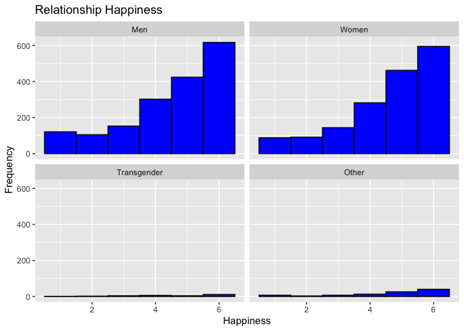<!-- -->

``` r
#Grouped by ANTIDEPRESSANT_USE
ggplot(Selected_Dataset, aes(x = Q17_1)) + facet_wrap(~ANTIDEPRESSANT_USE) +
  geom_histogram(binwidth = 1, fill = "blue", color = "black") +
  labs(title = "Relationship Happiness", x = "Happiness", y = "Frequency")
```

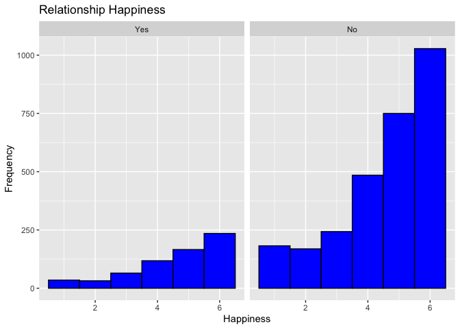<!-- -->

``` r
#Q19: I have a warm and comfortable relationship with my spouse/partner
#Grouped by GENDER
ggplot(Selected_Dataset, aes(x = Q19)) + facet_wrap(~GENDER) +
  geom_histogram(binwidth = 1, fill = "blue", color = "black") +
  labs(title = "Warm and Comfortable Relationship", x = "Warmth", y = "Frequency")
```

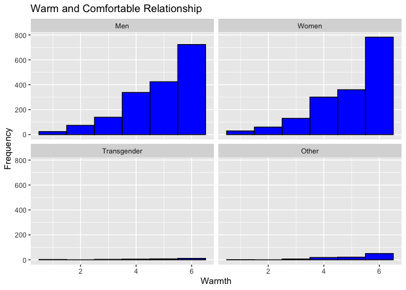<!-- -->

``` r
#Grouped by ANTIDEPRESSANT_USE
ggplot(Selected_Dataset, aes(x = Q19)) + facet_wrap(~ANTIDEPRESSANT_USE) +
  geom_histogram(binwidth = 1, fill = "blue", color = "black") +
  labs(title = "Warm and Comfortable Relationship", x = "Warmth", y = "Frequency")
```

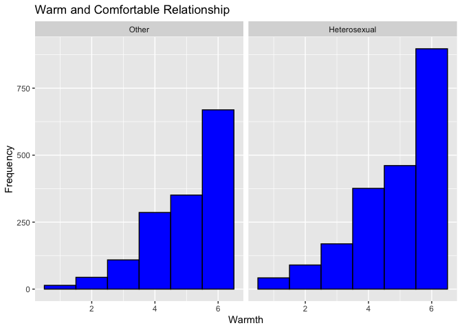<!-- -->

``` r
#Q20: How rewarding is your relationship with your spouse/partner? 
#Grouped by GENDER
ggplot(Selected_Dataset, aes(x = Q20))  + facet_wrap(~GENDER) +
  geom_histogram(binwidth = 1, fill = "blue", color = "black") +
  labs(title = "Rewarding Relationship", x = "Reward", y = "Frequency")
```

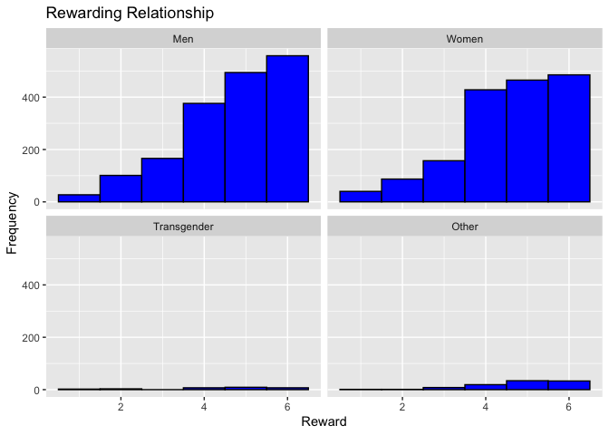<!-- -->

``` r
#Grouped by ANTIDEPRESSANT_USE
ggplot(Selected_Dataset, aes(x = Q20)) + facet_wrap(~ANTIDEPRESSANT_USE) +
  geom_histogram(binwidth = 1, fill = "blue", color = "black") +
  labs(title = "Rewarding Relationship", x = "Reward", y = "Frequency")
```

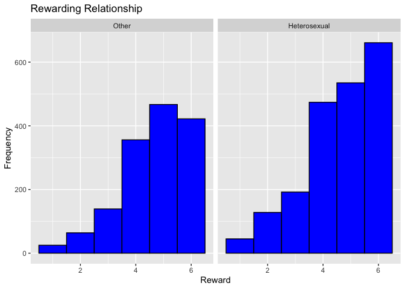<!-- -->

``` r
#Q21: In general, how satisfied are you with your relationship?
#Grouped by GENDER
ggplot(Selected_Dataset, aes(x = Q21))  + facet_wrap(~GENDER) +
  geom_histogram(binwidth = 1, fill = "blue", color = "black") +
  labs(title = "Relationship Satisfaction", x = "Satisfaction", y = "Frequency")
```

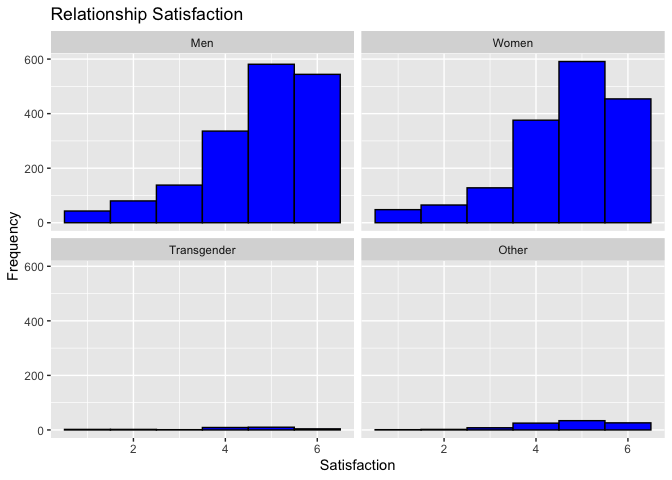<!-- -->

``` r
#Grouped by ANTIDEPRESSANT_USE
ggplot(Selected_Dataset, aes(x = Q21)) + facet_wrap(~ANTIDEPRESSANT_USE) +
  geom_histogram(binwidth = 1, fill = "blue", color = "black") +
  labs(title = "Relationship Satisfaction", x = "Satisfaction", y = "Frequency")
```

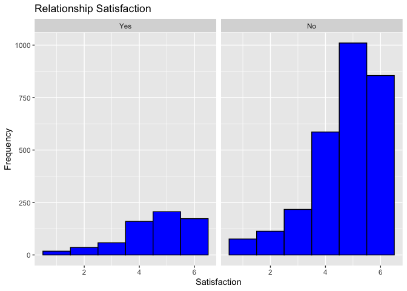<!-- -->

``` r
#Q22: In general, how committed are you to your current spouse/partner? (Numeric)
#Grouped by GENDER
ggplot(Selected_Dataset, aes(x = COMMITMENT))  + facet_wrap(~GENDER) +
  geom_histogram(binwidth = 1, fill = "blue", color = "black") +
  labs(title = "Relationship Commitment", x = "Commitment", y = "Frequency")
```

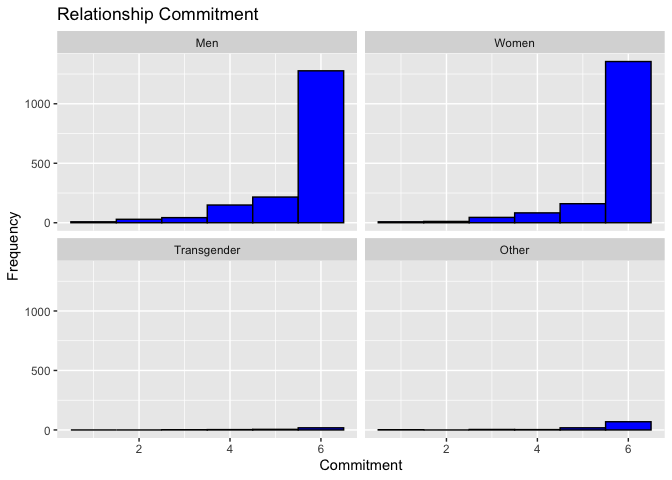<!-- -->

``` r
#Grouped by ANTIDEPRESSANT_USE
ggplot(Selected_Dataset, aes(x = COMMITMENT)) + facet_wrap(~ANTIDEPRESSANT_USE) +
  geom_histogram(binwidth = 1, fill = "blue", color = "black") +
  labs(title = "Relationship Commitment", x = "Commitment", y = "Frequency")
```

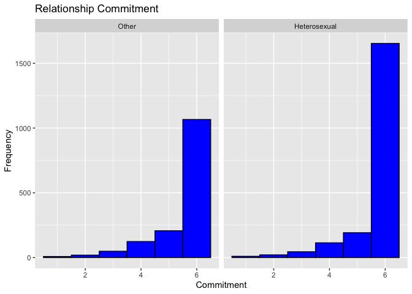<!-- -->

``` r
#Q117: How satisfied are you with your sexual relationship with your current spouse/partner? 
#Grouped by GENDER
ggplot(Selected_Dataset, aes(x = SEXUAL_SATISFACTION))  + facet_wrap(~GENDER) +
  geom_histogram(binwidth = 1, fill = "blue", color = "black") +
  labs(title = "Sexual Relationship Satisfaction", x = "Satisfaction", y = "Frequency")
```

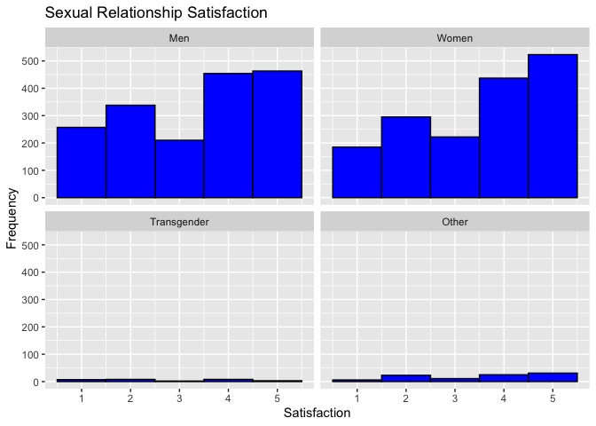<!-- -->

``` r
#Grouped by ANTIDEPRESSANT_USE
ggplot(Selected_Dataset, aes(x = SEXUAL_SATISFACTION)) + facet_wrap(~ANTIDEPRESSANT_USE) +
  geom_histogram(binwidth = 1, fill = "blue", color = "black") +
  labs(title = "Sexual Relationship Satisfaction", x = "Satisfaction", y = "Frequency")
```

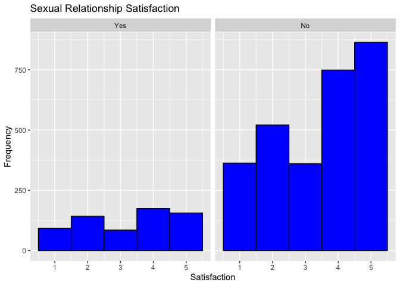<!-- -->

# Create Composite Variable

``` r
#For Relationship Satisfaction I will produce one composite variable out of variables Q17_1, Q19, Q20, Q21
#Mutate and create a new column. Use the average of each participants scores
Selected_Dataset$Relationship_Satisfaction <- rowMeans(Selected_Dataset %>% dplyr::select(Q17_1, Q19, Q20, Q21), na.rm = TRUE)

#plot the composite variable
ggplot(Selected_Dataset, aes(x = Relationship_Satisfaction)) +
  geom_histogram(binwidth = 1, fill = "blue", color = "black") +
  labs(title = "Relationship Satisfaction Composite Variable", x = "Relationship Satisfaction", y = "Frequency")
```

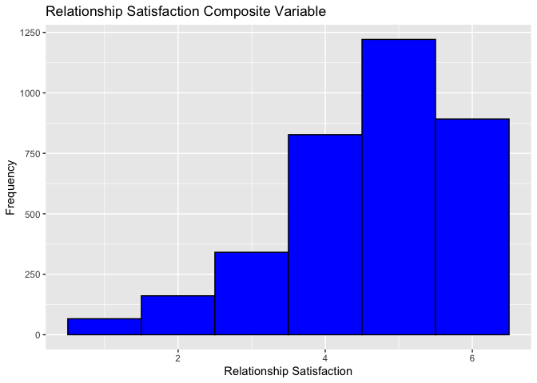<!-- -->

``` r
#Group By GENDER
ggplot(Selected_Dataset, aes(x = Relationship_Satisfaction)) + facet_wrap(~GENDER) +
  geom_histogram(binwidth = 1, fill = "blue", color = "black") +
  labs(title = "Relationship Satisfaction Composite Variable", x = "Relationship Satisfaction", y = "Frequency")
```

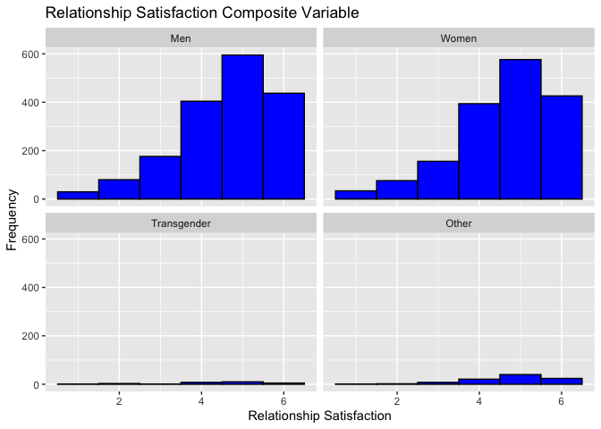<!-- -->

``` r
#Group By ANTIDEPRESSANT_USE
ggplot(Selected_Dataset, aes(x = Relationship_Satisfaction)) + facet_wrap(~ANTIDEPRESSANT_USE) +
  geom_histogram(binwidth = 1, fill = "blue", color = "black") +
  labs(title = "Relationship Satisfaction Composite Variable", x = "Relationship Satisfaction", y = "Frequency")
```

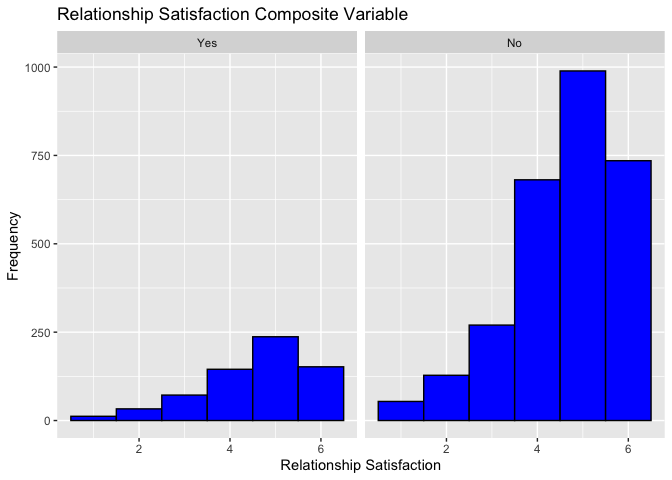<!-- -->

\#Check Normality of Distribution for each variable

``` r
kruskal.test(Selected_Dataset$Relationship_Satisfaction ~ Selected_Dataset$GENDER)
```

    ## 
    ##  Kruskal-Wallis rank sum test
    ## 
    ## data:  Selected_Dataset$Relationship_Satisfaction by Selected_Dataset$GENDER
    ## Kruskal-Wallis chi-squared = 2.5942, df = 3, p-value = 0.4585

``` r
kruskal.test(Selected_Dataset$Relationship_Satisfaction ~ Selected_Dataset$ANTIDEPRESSANT_USE)
```

    ## 
    ##  Kruskal-Wallis rank sum test
    ## 
    ## data:  Selected_Dataset$Relationship_Satisfaction by Selected_Dataset$ANTIDEPRESSANT_USE
    ## Kruskal-Wallis chi-squared = 0.6303, df = 1, p-value = 0.4272

``` r
kruskal.test(Selected_Dataset$SEXUAL_SATISFACTION ~ Selected_Dataset$GENDER)
```

    ## 
    ##  Kruskal-Wallis rank sum test
    ## 
    ## data:  Selected_Dataset$SEXUAL_SATISFACTION by Selected_Dataset$GENDER
    ## Kruskal-Wallis chi-squared = 21.798, df = 3, p-value = 7.187e-05

``` r
kruskal.test(Selected_Dataset$SEXUAL_SATISFACTION ~ Selected_Dataset$ANTIDEPRESSANT_USE)
```

    ## 
    ##  Kruskal-Wallis rank sum test
    ## 
    ## data:  Selected_Dataset$SEXUAL_SATISFACTION by Selected_Dataset$ANTIDEPRESSANT_USE
    ## Kruskal-Wallis chi-squared = 10.107, df = 1, p-value = 0.001477

``` r
kruskal.test(Selected_Dataset$COMMITMENT ~ Selected_Dataset$GENDER)
```

    ## 
    ##  Kruskal-Wallis rank sum test
    ## 
    ## data:  Selected_Dataset$COMMITMENT by Selected_Dataset$GENDER
    ## Kruskal-Wallis chi-squared = 30.757, df = 3, p-value = 9.561e-07

``` r
kruskal.test(Selected_Dataset$COMMITMENT ~ Selected_Dataset$ANTIDEPRESSANT_USE)
```

    ## 
    ##  Kruskal-Wallis rank sum test
    ## 
    ## data:  Selected_Dataset$COMMITMENT by Selected_Dataset$ANTIDEPRESSANT_USE
    ## Kruskal-Wallis chi-squared = 1.5121, df = 1, p-value = 0.2188

\#Secondary Normality Check

``` r
table(Selected_Dataset$GENDER, Selected_Dataset$ANTIDEPRESSANT_USE)
```

    ##              
    ##                Yes   No
    ##   Men          214 1508
    ##   Women        393 1269
    ##   Transgender   12   16
    ##   Other         32   64

Since the tests for Normality has failed for Gender, I will merge
Transgenger and Other to a single group called Other

``` r
# Merge Transgender and Other into a single group called Other
Selected_Dataset$GENDER <- droplevels(dplyr::recode(Selected_Dataset$GENDER, "Transgender" = "Other"))

table(Selected_Dataset$GENDER, Selected_Dataset$ANTIDEPRESSANT_USE)
```

    ##        
    ##          Yes   No
    ##   Men    214 1508
    ##   Women  393 1269
    ##   Other   44   80

Verified that now all groups have enough N to satisfy Central Limit
Theorem.

\#Check for Equality of Variance

``` r
#Levine's Test

leveneTest(Selected_Dataset$Relationship_Satisfaction ~ Selected_Dataset$GENDER)
```

    ## Levene's Test for Homogeneity of Variance (center = median)
    ##         Df F value Pr(>F)
    ## group    2  0.5282 0.5897
    ##       3505

``` r
# Fail to reject Null Hypothesis: Variances are equal

leveneTest(Selected_Dataset$Relationship_Satisfaction ~ Selected_Dataset$ANTIDEPRESSANT_USE)
```

    ## Levene's Test for Homogeneity of Variance (center = median)
    ##         Df F value Pr(>F)
    ## group    1  0.5837 0.4449
    ##       3506

``` r
# Fail to reject Null Hypothesis: Variances are equal


leveneTest(Selected_Dataset$SEXUAL_SATISFACTION ~ Selected_Dataset$GENDER)
```

    ## Levene's Test for Homogeneity of Variance (center = median)
    ##         Df F value  Pr(>F)  
    ## group    2  3.9925 0.01854 *
    ##       3505                  
    ## ---
    ## Signif. codes:  0 '***' 0.001 '**' 0.01 '*' 0.05 '.' 0.1 ' ' 1

``` r
# Reject Null Hypothesis: Variances are not equal -- Use Welch ANOVA 

leveneTest(Selected_Dataset$SEXUAL_SATISFACTION ~ Selected_Dataset$ANTIDEPRESSANT_USE)
```

    ## Levene's Test for Homogeneity of Variance (center = median)
    ##         Df F value Pr(>F)
    ## group    1  1.9812 0.1593
    ##       3506

``` r
# Fail to reject Null Hypothesis: Variances are equal


leveneTest(Selected_Dataset$COMMITMENT ~ Selected_Dataset$GENDER)
```

    ## Levene's Test for Homogeneity of Variance (center = median)
    ##         Df F value   Pr(>F)    
    ## group    2  11.097 1.57e-05 ***
    ##       3505                     
    ## ---
    ## Signif. codes:  0 '***' 0.001 '**' 0.01 '*' 0.05 '.' 0.1 ' ' 1

``` r
# Reject Null Hypothesis: Variances are not equal -- Use Welch ANOVA 

leveneTest(Selected_Dataset$COMMITMENT ~ Selected_Dataset$ANTIDEPRESSANT_USE)
```

    ## Levene's Test for Homogeneity of Variance (center = median)
    ##         Df F value Pr(>F)
    ## group    1   2.029 0.1544
    ##       3506

``` r
# Fail to reject Null Hypothesis: Variances are equal
```

Sexual Satisfaction and Commitment do not pass the assumption of
homogeneity of variance. I will do a log transformation of the data

``` r
Selected_Dataset$SEXUAL_SATISFACTION <- log(Selected_Dataset$SEXUAL_SATISFACTION)
Selected_Dataset$COMMITMENT <- log(Selected_Dataset$COMMITMENT)
```

Recheck for Equality of Variance

``` r
leveneTest(Selected_Dataset$SEXUAL_SATISFACTION ~ Selected_Dataset$GENDER)
```

    ## Levene's Test for Homogeneity of Variance (center = median)
    ##         Df F value   Pr(>F)   
    ## group    2  5.8864 0.002805 **
    ##       3505                    
    ## ---
    ## Signif. codes:  0 '***' 0.001 '**' 0.01 '*' 0.05 '.' 0.1 ' ' 1

``` r
leveneTest(Selected_Dataset$COMMITMENT ~ Selected_Dataset$GENDER)
```

    ## Levene's Test for Homogeneity of Variance (center = median)
    ##         Df F value    Pr(>F)    
    ## group    2  8.3808 0.0002338 ***
    ##       3505                      
    ## ---
    ## Signif. codes:  0 '***' 0.001 '**' 0.01 '*' 0.05 '.' 0.1 ' ' 1

\#Check Independent Observation Assumption

Given the nature of the survey, I assume that they design of this survey
means that respondents are all independent of each other.

\#Violated Assumptions and Fixes

For the tests that do not pass the assumptions of normality, I merged
the Trangsenger and Other groups into a single group called Other. This
new group has a sufficiently large N to satisfy the Central Limit
Theorem. For the tests that do not pass the assumptions of homogeneity
of variance, I have transposed the data using a log transformation.

\#Data Analysis

2x3 Design - IV: Antidepressants vs No Antidepressants - IV: Gender: Man
vs Woman vs Other

- DV: Relationship Satisfaction
- DV: Sexual Satisfaction
- DV: Commitment

``` r
#Relationship Satisfaction

#descriptive Statistics
group_by(Selected_Dataset, GENDER, ANTIDEPRESSANT_USE) %>%
  dplyr::summarise(
    mean = mean(Relationship_Satisfaction, na.rm = TRUE),
    sd = sd(Relationship_Satisfaction, na.rm = TRUE)
  )
```

    ## `summarise()` has grouped output by 'GENDER'. You can override using the
    ## `.groups` argument.

    ## # A tibble: 6 × 4
    ## # Groups:   GENDER [3]
    ##   GENDER ANTIDEPRESSANT_USE  mean    sd
    ##   <fct>  <fct>              <dbl> <dbl>
    ## 1 Men    Yes                 4.51  1.27
    ## 2 Men    No                  4.75  1.13
    ## 3 Women  Yes                 4.77  1.12
    ## 4 Women  No                  4.71  1.17
    ## 5 Other  Yes                 4.82  1.12
    ## 6 Other  No                  4.80  1.10

``` r
#2x3 MANOVA
Satisfaction_Model <- aov(Relationship_Satisfaction ~  GENDER*ANTIDEPRESSANT_USE, data = Selected_Dataset)

summary(Satisfaction_Model)
```

    ##                             Df Sum Sq Mean Sq F value Pr(>F)  
    ## GENDER                       2      1   0.484   0.365 0.6940  
    ## ANTIDEPRESSANT_USE           1      2   1.508   1.140 0.2858  
    ## GENDER:ANTIDEPRESSANT_USE    2     10   5.223   3.946 0.0194 *
    ## Residuals                 3502   4635   1.324                 
    ## ---
    ## Signif. codes:  0 '***' 0.001 '**' 0.01 '*' 0.05 '.' 0.1 ' ' 1

``` r
# Post Hoc
TukeyHSD(Satisfaction_Model, which = "GENDER:ANTIDEPRESSANT_USE")
```

    ##   Tukey multiple comparisons of means
    ##     95% family-wise confidence level
    ## 
    ## Fit: aov(formula = Relationship_Satisfaction ~ GENDER * ANTIDEPRESSANT_USE, data = Selected_Dataset)
    ## 
    ## $`GENDER:ANTIDEPRESSANT_USE`
    ##                            diff          lwr        upr     p adj
    ## Women:Yes-Men:Yes    0.26207462 -0.016612113 0.54076136 0.0792162
    ## Other:Yes-Men:Yes    0.31685429 -0.226148103 0.85985668 0.5560028
    ## Men:No-Men:Yes       0.24216174  0.002535635 0.48178785 0.0459046
    ## Women:No-Men:Yes     0.20575661 -0.036657553 0.44817078 0.1494779
    ## Other:No-Men:Yes     0.29611565 -0.133764010 0.72599532 0.3633898
    ## Other:Yes-Women:Yes  0.05477967 -0.466707014 0.57626635 0.9996785
    ## Men:No-Women:Yes    -0.01991288 -0.205701553 0.16587579 0.9996452
    ## Women:No-Women:Yes  -0.05631801 -0.245689041 0.13305302 0.9583930
    ## Other:No-Women:Yes   0.03404103 -0.368318615 0.43640068 0.9998891
    ## Men:No-Other:Yes    -0.07469255 -0.576392392 0.42700729 0.9982511
    ## Women:No-Other:Yes  -0.11109768 -0.614135142 0.39193978 0.9888337
    ## Other:No-Other:Yes  -0.02073864 -0.636432218 0.59495495 0.9999989
    ## Women:No-Men:No     -0.03640513 -0.161368168 0.08855791 0.9618868
    ## Other:No-Men:No      0.05395391 -0.322407163 0.43031499 0.9985418
    ## Other:No-Women:No    0.09035904 -0.287783279 0.46850136 0.9840372

``` r
#Plot
ggplot(Selected_Dataset, aes(x = ANTIDEPRESSANT_USE, y = Relationship_Satisfaction, fill = GENDER)
       ) + geom_boxplot() + labs(title = "Relationship Satisfaction by Antidepressant Use", x = "Antidepressant Use", y = "Relationship Satisfaction")
```

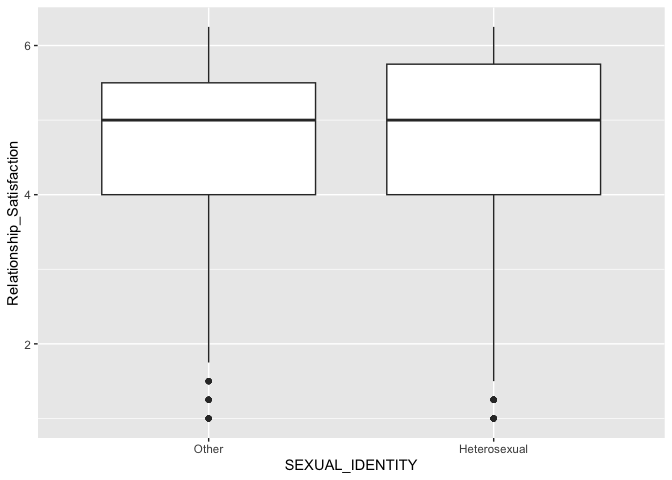<!-- -->
Results: Main Effects are not significant - Fail to reject the null
hypothesis. At least one Interaction between Anti-Depressant Use and
Gender is significant p = .0459046

``` r
#Sexual Satisfaction

#descriptive Statistics
group_by(Selected_Dataset, GENDER, ANTIDEPRESSANT_USE) %>%
  dplyr::summarise(
    mean = mean(SEXUAL_SATISFACTION, na.rm = TRUE),
    sd = sd(SEXUAL_SATISFACTION, na.rm = TRUE)
  )
```

    ## `summarise()` has grouped output by 'GENDER'. You can override using the
    ## `.groups` argument.

    ## # A tibble: 6 × 4
    ## # Groups:   GENDER [3]
    ##   GENDER ANTIDEPRESSANT_USE  mean    sd
    ##   <fct>  <fct>              <dbl> <dbl>
    ## 1 Men    Yes                0.921 0.600
    ## 2 Men    No                 1.09  0.541
    ## 3 Women  Yes                1.13  0.495
    ## 4 Women  No                 1.14  0.522
    ## 5 Other  Yes                1.03  0.472
    ## 6 Other  No                 1.13  0.534

``` r
#3x2 ANOVA
Sexual_Satisfaction_Model <- aov(SEXUAL_SATISFACTION ~ GENDER * ANTIDEPRESSANT_USE, data = Selected_Dataset)

summary(Sexual_Satisfaction_Model)
```

    ##                             Df Sum Sq Mean Sq F value   Pr(>F)    
    ## GENDER                       2    4.4  2.2235   7.859 0.000393 ***
    ## ANTIDEPRESSANT_USE           1    3.0  2.9615  10.468 0.001226 ** 
    ## GENDER:ANTIDEPRESSANT_USE    2    2.7  1.3459   4.757 0.008645 ** 
    ## Residuals                 3502  990.8  0.2829                     
    ## ---
    ## Signif. codes:  0 '***' 0.001 '**' 0.01 '*' 0.05 '.' 0.1 ' ' 1

``` r
# Post Hoc
TukeyHSD(Sexual_Satisfaction_Model, which = "GENDER:ANTIDEPRESSANT_USE")
```

    ##   Tukey multiple comparisons of means
    ##     95% family-wise confidence level
    ## 
    ## Fit: aov(formula = SEXUAL_SATISFACTION ~ GENDER * ANTIDEPRESSANT_USE, data = Selected_Dataset)
    ## 
    ## $`GENDER:ANTIDEPRESSANT_USE`
    ##                             diff          lwr        upr     p adj
    ## Women:Yes-Men:Yes    0.207582252  0.078739522 0.33642498 0.0000660
    ## Other:Yes-Men:Yes    0.112897206 -0.138144202 0.36393861 0.7948771
    ## Men:No-Men:Yes       0.168053922  0.057269742 0.27883810 0.0002266
    ## Women:No-Men:Yes     0.223394870  0.111321711 0.33546803 0.0000002
    ## Other:No-Men:Yes     0.213195920  0.014453525 0.41193831 0.0271735
    ## Other:Yes-Women:Yes -0.094685046 -0.335779288 0.14640920 0.8733491
    ## Men:No-Women:Yes    -0.039528329 -0.125422333 0.04636567 0.7784345
    ## Women:No-Women:Yes   0.015812618 -0.071737585 0.10336282 0.9956135
    ## Other:No-Women:Yes   0.005613668 -0.180405645 0.19163298 0.9999993
    ## Men:No-Other:Yes     0.055156716 -0.176789655 0.28710309 0.9843819
    ## Women:No-Other:Yes   0.110497664 -0.122067117 0.34306245 0.7540913
    ## Other:No-Other:Yes   0.100298714 -0.184349357 0.38494678 0.9165351
    ## Women:No-Men:No      0.055340947 -0.002432089 0.11311398 0.0694617
    ## Other:No-Men:No      0.045141997 -0.128857630 0.21914162 0.9769673
    ## Other:No-Women:No   -0.010198950 -0.185022085 0.16462418 0.9999824

``` r
#Plot
ggplot(Selected_Dataset, aes(x = ANTIDEPRESSANT_USE, y = SEXUAL_SATISFACTION, fill = GENDER)
       ) + geom_boxplot() + labs(title = "Sexual Satisfaction by Antidepressant Use", x = "Antidepressant Use", y = "Sexual Satisfaction")
```

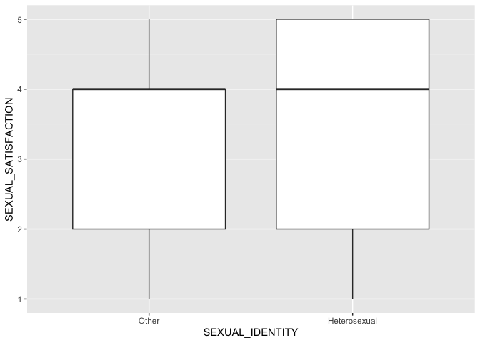<!-- -->

``` r
#Commitment

#descriptive Statistics
group_by(Selected_Dataset, GENDER, ANTIDEPRESSANT_USE ) %>%
  dplyr::summarise(
    mean = mean(COMMITMENT, na.rm = TRUE),
    sd = sd(COMMITMENT, na.rm = TRUE)
  )
```

    ## `summarise()` has grouped output by 'GENDER'. You can override using the
    ## `.groups` argument.

    ## # A tibble: 6 × 4
    ## # Groups:   GENDER [3]
    ##   GENDER ANTIDEPRESSANT_USE  mean    sd
    ##   <fct>  <fct>              <dbl> <dbl>
    ## 1 Men    Yes                 1.63 0.314
    ## 2 Men    No                  1.70 0.220
    ## 3 Women  Yes                 1.73 0.175
    ## 4 Women  No                  1.72 0.215
    ## 5 Other  Yes                 1.69 0.182
    ## 6 Other  No                  1.67 0.317

``` r
#3x2 ANOVA
Commitment_Model <- aov(COMMITMENT ~ GENDER* ANTIDEPRESSANT_USE , data = Selected_Dataset)

summary(Commitment_Model)
```

    ##                             Df Sum Sq Mean Sq F value   Pr(>F)    
    ## GENDER                       2   0.84  0.4191   8.413 0.000226 ***
    ## ANTIDEPRESSANT_USE           1   0.15  0.1501   3.014 0.082656 .  
    ## GENDER:ANTIDEPRESSANT_USE    2   0.68  0.3396   6.816 0.001110 ** 
    ## Residuals                 3502 174.45  0.0498                     
    ## ---
    ## Signif. codes:  0 '***' 0.001 '**' 0.01 '*' 0.05 '.' 0.1 ' ' 1

``` r
# Post Hoc
TukeyHSD(Commitment_Model, which = "GENDER:ANTIDEPRESSANT_USE")
```

    ##   Tukey multiple comparisons of means
    ##     95% family-wise confidence level
    ## 
    ## Fit: aov(formula = COMMITMENT ~ GENDER * ANTIDEPRESSANT_USE, data = Selected_Dataset)
    ## 
    ## $`GENDER:ANTIDEPRESSANT_USE`
    ##                             diff          lwr         upr     p adj
    ## Women:Yes-Men:Yes    0.094086923  0.040022639 0.148151207 0.0000108
    ## Other:Yes-Men:Yes    0.053402312 -0.051938315 0.158742939 0.6990497
    ## Men:No-Men:Yes       0.065060165  0.018573511 0.111546819 0.0009504
    ## Women:No-Men:Yes     0.084279155  0.037251627 0.131306683 0.0000050
    ## Other:No-Men:Yes     0.037568267 -0.045826934 0.120963467 0.7936899
    ## Other:Yes-Women:Yes -0.040684611 -0.141851262 0.060482041 0.8617393
    ## Men:No-Women:Yes    -0.029026759 -0.065069132 0.007015615 0.1957058
    ## Women:No-Women:Yes  -0.009807768 -0.046545107 0.026929571 0.9738777
    ## Other:No-Women:Yes  -0.056518657 -0.134575067 0.021537753 0.3062952
    ## Men:No-Other:Yes     0.011657852 -0.085670220 0.108985924 0.9993895
    ## Women:No-Other:Yes   0.030876843 -0.066710723 0.128464408 0.9460492
    ## Other:No-Other:Yes  -0.015834046 -0.135276518 0.103608426 0.9990007
    ## Women:No-Men:No      0.019218990 -0.005023416 0.043461397 0.2107579
    ## Other:No-Men:No     -0.027491898 -0.100504673 0.045520877 0.8919590
    ## Other:No-Women:No   -0.046710889 -0.120069219 0.026647442 0.4557231

``` r
#Plot
ggplot(Commitment_Model, aes(x = ANTIDEPRESSANT_USE, y = COMMITMENT, fill = GENDER)
       ) + geom_boxplot() + labs(title = "Commitment by Antidepressant Use", x = "Antidepressant Use", y = "Relationship Satisfaction")
```

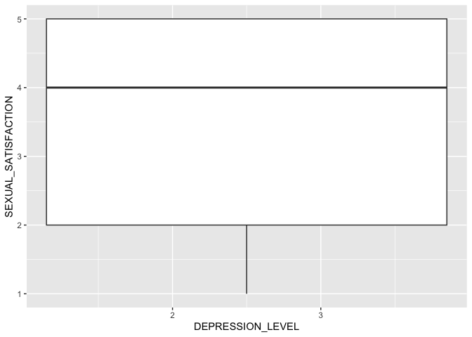<!-- -->

\#Results
