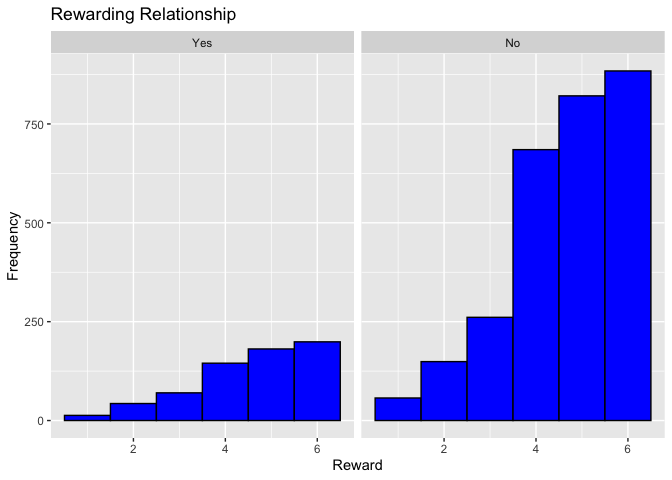
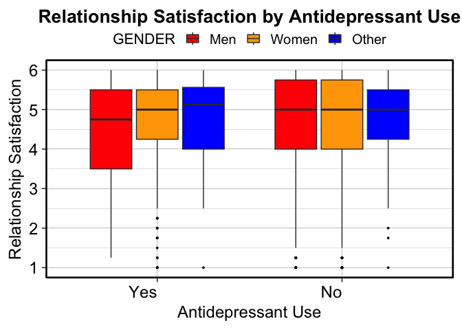
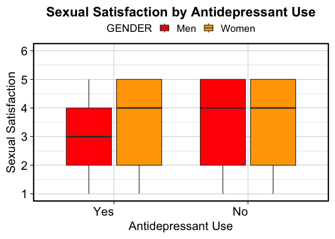
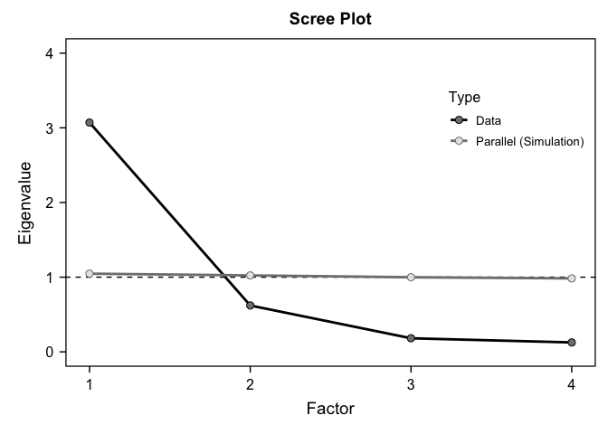
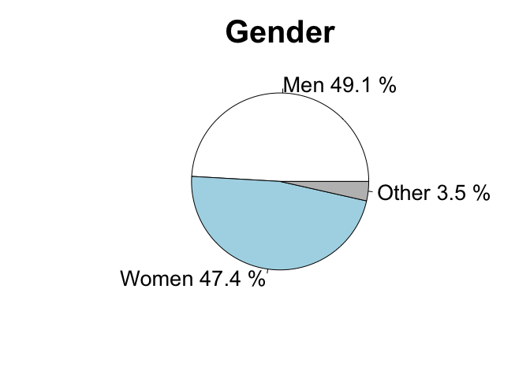

Research Project
================
Jennifer Habicher
2024-11-28

# load packages and dataset

``` r
library (haven)
library (plyr)
library (dplyr)
```

    ## 
    ## Attaching package: 'dplyr'

    ## The following objects are masked from 'package:plyr':
    ## 
    ##     arrange, count, desc, failwith, id, mutate, rename, summarise,
    ##     summarize

    ## The following objects are masked from 'package:stats':
    ## 
    ##     filter, lag

    ## The following objects are masked from 'package:base':
    ## 
    ##     intersect, setdiff, setequal, union

``` r
library (ggplot2)
library (psych)
```

    ## 
    ## Attaching package: 'psych'

    ## The following objects are masked from 'package:ggplot2':
    ## 
    ##     %+%, alpha

``` r
library (car)
```

    ## Loading required package: carData

    ## 
    ## Attaching package: 'car'

    ## The following object is masked from 'package:psych':
    ## 
    ##     logit

    ## The following object is masked from 'package:dplyr':
    ## 
    ##     recode

``` r
library (multcomp)
```

    ## Loading required package: mvtnorm

    ## Loading required package: survival

    ## Loading required package: TH.data

    ## Loading required package: MASS

    ## 
    ## Attaching package: 'MASS'

    ## The following object is masked from 'package:dplyr':
    ## 
    ##     select

    ## 
    ## Attaching package: 'TH.data'

    ## The following object is masked from 'package:MASS':
    ## 
    ##     geyser

``` r
library (Rmisc)
```

    ## Loading required package: lattice

``` r
library (bruceR)
```

    ## 
    ## bruceR (v2024.6)
    ## Broadly Useful Convenient and Efficient R functions
    ## 
    ## Packages also loaded:
    ## ✔ data.table ✔ emmeans
    ## ✔ dplyr      ✔ lmerTest
    ## ✔ tidyr      ✔ effectsize
    ## ✔ stringr    ✔ performance
    ## ✔ ggplot2    ✔ interactions
    ## 
    ## Main functions of `bruceR`:
    ## cc()             Describe()  TTEST()
    ## add()            Freq()      MANOVA()
    ## .mean()          Corr()      EMMEANS()
    ## set.wd()         Alpha()     PROCESS()
    ## import()         EFA()       model_summary()
    ## print_table()    CFA()       lavaan_summary()
    ## 
    ## For full functionality, please install all dependencies:
    ## install.packages("bruceR", dep=TRUE)
    ## 
    ## Online documentation:
    ## https://psychbruce.github.io/bruceR
    ## 
    ## To use this package in publications, please cite:
    ## Bao, H.-W.-S. (2024). bruceR: Broadly useful convenient and efficient R functions (Version 2024.6) [Computer software]. https://CRAN.R-project.org/package=bruceR

    ## 
    ## These packages are dependencies of `bruceR` but not installed:
    ## - pacman, openxlsx, ggtext, lmtest, vars, phia, MuMIn, GGally
    ## 
    ## ***** Install all dependencies *****
    ## install.packages("bruceR", dep=TRUE)

``` r
#load Dataset
load("ICPSR_38417/DS0001/38417-0001-Data.rda")
```

``` r
Selected_Dataset <- da38417.0001 %>%
  dplyr::select(Q17_1, Q19, Q20, Q21, Q22, Q117, Q65, Q55E, D2, HHR5, IDENTITY_1_R)
```

# Recode Variables

``` r
#Q17_1: Please indicate the level of happiness, all things considered, in your relationship 

#Recoding Extremely Happy and Perfect to both read 6 to keep the composite variable the same
Selected_Dataset$Q17_1 <- dplyr::recode(Selected_Dataset$Q17_1, "(1) Extremely unhappy" = 1, "(2) Fairly unhappy" = 2, "(3) A little unhappy" = 3, "(4) Happy" = 4, "(5) Very happy" = 5, "(6) Extremely happy" = 6, "(7) Perfect" = 6)

#Q19: I have a warm and comfortable relationship with my spouse/partner
Selected_Dataset$Q19 <- dplyr::recode(Selected_Dataset$Q19, "(1) Not at all true" = 1, "(2) A little true" = 2, "(3) Somewhat true" = 3, "(4) Mostly true" = 4, "(5) Almost completely true" = 5, "(6) Completely true" = 6)

#Q20: How rewarding is your relationship with your spouse/partner? 
Selected_Dataset$Q20 <- dplyr::recode(Selected_Dataset$Q20, "(1) Not at all rewarding" = 1, "(2) A little rewarding" = 2, "(3) Somewhat rewarding" = 3, "(4) Mostly rewarding" = 4, "(5) Almost completely rewarding" = 5, "(6) Completely rewarding" = 6)

#Q21: In general, how satisfied are you with your relationship? 
Selected_Dataset$Q21 <- dplyr::recode(Selected_Dataset$Q21, "(1) Not at all satisfied" = 1, "(2) A little satisfied" = 2, "(3) Somewhat satisfied" = 3, "(4) Mostly satisfied" = 4, "(5) Almost completely satisfied" = 5, "(6) Completely satisfied" = 6)

#Q22: In general, how committed are you to your current spouse/partner?
Selected_Dataset$COMMITMENT <- dplyr::recode(Selected_Dataset$Q22, "(1) Not at all committed" = 1, "(2) A little committed" = 2, "(3) Somewhat committed" = 3, "(4) Mostly committed" = 4, "(5) Almost completely committed" = 5, "(6) Completely committed" = 6)

#Q117: How satisfied are you with your sexual relationship with your current spouse/partner? 
Selected_Dataset$SEXUAL_SATISFACTION <- dplyr::recode(Selected_Dataset$Q117, "(1) Very dissatisfied" = 1, "(2) Somewhat dissatisfied" = 2, "(3) Neither satisfied or dissatisfied" = 3, "(4) Somewhat satisfied" = 4, "(5) Very satisfied" = 5)

#Q65: In the past 30 days have you used antidepressant medication
Selected_Dataset$ANTIDEPRESSANT_USE <- droplevels(dplyr::recode(Selected_Dataset$Q65, "(1) Yes" = "Yes", "(2) No" = "No"))

#Q55E: I felt depressed
Selected_Dataset$DEPRESSION_LEVEL <- droplevels(dplyr::recode(Selected_Dataset$Q55E, "(1) Rarely or none of the time (Less than 1 day)" = "Rarely/None", "(2) Some or a little of the time (1-2 days)" = "Some", "(3) Occasionally or a moderate amount of time (3-4 days)" = "Occasionally", "(4) Most or all of the time (5-7 days)" = "Most/All"))

#D2: Which of the following best describes your gender?
Selected_Dataset$GENDER <- droplevels(dplyr::recode(Selected_Dataset$D2, "(1) Man" = "Men", "(2) Woman" = "Women", "(3) Transgender" = "Transgender","(5) Do not identify as any of the above (there is an option to specify at next question)" = "Other"))

#IDENTITY_1_R IDENTITY. Which of the following do you consider yourself to be? (select all that apply) 1. Heterosexual or "straight"
Selected_Dataset$SEXUAL_IDENTITY <- droplevels(dplyr::recode(Selected_Dataset$IDENTITY_1_R, "(1) Heterosexual" = "Heterosexual", "(-99) Valid Non-Response" = "Other"))


#Remove NA values
Selected_Dataset <- na.omit(Selected_Dataset)
```

\#Graphs for Recoded Variables

``` r
#Q17_1: Please indicate the level of happiness, all things considered, in your relationship 
#Grouped by GENDER
ggplot(Selected_Dataset, aes(x = Q17_1)) + facet_wrap(~GENDER) +
  geom_histogram(binwidth = 1, fill = "blue", color = "black") +
  labs(title = "Relationship Happiness", x = "Happiness", y = "Frequency")
```

<!-- -->

``` r
#Grouped by ANTIDEPRESSANT_USE
ggplot(Selected_Dataset, aes(x = Q17_1)) + facet_wrap(~ANTIDEPRESSANT_USE) +
  geom_histogram(binwidth = 1, fill = "blue", color = "black") +
  labs(title = "Relationship Happiness", x = "Happiness", y = "Frequency")
```

<!-- -->

``` r
#Q19: I have a warm and comfortable relationship with my spouse/partner
#Grouped by GENDER
ggplot(Selected_Dataset, aes(x = Q19)) + facet_wrap(~GENDER) +
  geom_histogram(binwidth = 1, fill = "blue", color = "black") +
  labs(title = "Warm and Comfortable Relationship", x = "Warmth", y = "Frequency")
```

<!-- -->

``` r
#Grouped by ANTIDEPRESSANT_USE
ggplot(Selected_Dataset, aes(x = Q19)) + facet_wrap(~ANTIDEPRESSANT_USE) +
  geom_histogram(binwidth = 1, fill = "blue", color = "black") +
  labs(title = "Warm and Comfortable Relationship", x = "Warmth", y = "Frequency")
```

<!-- -->

``` r
#Q20: How rewarding is your relationship with your spouse/partner? 
#Grouped by GENDER
ggplot(Selected_Dataset, aes(x = Q20))  + facet_wrap(~GENDER) +
  geom_histogram(binwidth = 1, fill = "blue", color = "black") +
  labs(title = "Rewarding Relationship", x = "Reward", y = "Frequency")
```

<!-- -->

``` r
#Grouped by ANTIDEPRESSANT_USE
ggplot(Selected_Dataset, aes(x = Q20)) + facet_wrap(~ANTIDEPRESSANT_USE) +
  geom_histogram(binwidth = 1, fill = "blue", color = "black") +
  labs(title = "Rewarding Relationship", x = "Reward", y = "Frequency")
```

<!-- -->

``` r
#Q21: In general, how satisfied are you with your relationship?
#Grouped by GENDER
ggplot(Selected_Dataset, aes(x = Q21))  + facet_wrap(~GENDER) +
  geom_histogram(binwidth = 1, fill = "blue", color = "black") +
  labs(title = "Relationship Satisfaction", x = "Satisfaction", y = "Frequency")
```

<!-- -->

``` r
#Grouped by ANTIDEPRESSANT_USE
ggplot(Selected_Dataset, aes(x = Q21)) + facet_wrap(~ANTIDEPRESSANT_USE) +
  geom_histogram(binwidth = 1, fill = "blue", color = "black") +
  labs(title = "Relationship Satisfaction", x = "Satisfaction", y = "Frequency")
```

<!-- -->

``` r
#Q22: In general, how committed are you to your current spouse/partner? (Numeric)
#Grouped by GENDER
ggplot(Selected_Dataset, aes(x = COMMITMENT))  + facet_wrap(~GENDER) +
  geom_histogram(binwidth = 1, fill = "blue", color = "black") +
  labs(title = "Relationship Commitment", x = "Commitment", y = "Frequency")
```

<!-- -->

``` r
#Grouped by ANTIDEPRESSANT_USE
ggplot(Selected_Dataset, aes(x = COMMITMENT)) + facet_wrap(~ANTIDEPRESSANT_USE) +
  geom_histogram(binwidth = 1, fill = "blue", color = "black") +
  labs(title = "Relationship Commitment", x = "Commitment", y = "Frequency")
```

<!-- -->

``` r
#Q117: How satisfied are you with your sexual relationship with your current spouse/partner? 
#Grouped by GENDER
ggplot(Selected_Dataset, aes(x = SEXUAL_SATISFACTION))  + facet_wrap(~GENDER) +
  geom_histogram(binwidth = 1, fill = "blue", color = "black") +
  labs(title = "Sexual Relationship Satisfaction", x = "Satisfaction", y = "Frequency")
```

<!-- -->

``` r
#Grouped by ANTIDEPRESSANT_USE
ggplot(Selected_Dataset, aes(x = SEXUAL_SATISFACTION)) + facet_wrap(~ANTIDEPRESSANT_USE) +
  geom_histogram(binwidth = 1, fill = "blue", color = "black") +
  labs(title = "Sexual Relationship Satisfaction", x = "Satisfaction", y = "Frequency")
```

<!-- -->

# Create Composite Variable

``` r
#For Relationship Satisfaction I will produce one composite variable out of variables Q17_1, Q19, Q20, Q21
#Mutate and create a new column. Use the average of each participants scores
Selected_Dataset$Relationship_Satisfaction <- rowMeans(Selected_Dataset %>% dplyr::select(Q17_1, Q19, Q20, Q21), na.rm = TRUE)

#plot the composite variable
ggplot(Selected_Dataset, aes(x = Relationship_Satisfaction)) +
  geom_histogram(binwidth = 1, fill = "blue", color = "black") +
  labs(title = "Relationship Satisfaction Composite Variable", x = "Relationship Satisfaction", y = "Frequency")
```

<!-- -->

``` r
#Group By GENDER
ggplot(Selected_Dataset, aes(x = Relationship_Satisfaction)) + facet_wrap(~GENDER) +
  geom_histogram(binwidth = 1, fill = "blue", color = "black") +
  labs(title = "Relationship Satisfaction Composite Variable", x = "Relationship Satisfaction", y = "Frequency")
```

<!-- -->

``` r
#Group By ANTIDEPRESSANT_USE
ggplot(Selected_Dataset, aes(x = Relationship_Satisfaction)) + facet_wrap(~ANTIDEPRESSANT_USE) +
  geom_histogram(binwidth = 1, fill = "blue", color = "black") +
  labs(title = "Relationship Satisfaction Composite Variable", x = "Relationship Satisfaction", y = "Frequency")
```

<!-- -->

\#Check Normality of Distribution for each variable

``` r
kruskal.test(Selected_Dataset$Relationship_Satisfaction ~ Selected_Dataset$GENDER)
```

    ## 
    ##  Kruskal-Wallis rank sum test
    ## 
    ## data:  Selected_Dataset$Relationship_Satisfaction by Selected_Dataset$GENDER
    ## Kruskal-Wallis chi-squared = 2.6366, df = 3, p-value = 0.4511

``` r
kruskal.test(Selected_Dataset$Relationship_Satisfaction ~ Selected_Dataset$ANTIDEPRESSANT_USE)
```

    ## 
    ##  Kruskal-Wallis rank sum test
    ## 
    ## data:  Selected_Dataset$Relationship_Satisfaction by Selected_Dataset$ANTIDEPRESSANT_USE
    ## Kruskal-Wallis chi-squared = 0.59248, df = 1, p-value = 0.4415

``` r
kruskal.test(Selected_Dataset$SEXUAL_SATISFACTION ~ Selected_Dataset$GENDER)
```

    ## 
    ##  Kruskal-Wallis rank sum test
    ## 
    ## data:  Selected_Dataset$SEXUAL_SATISFACTION by Selected_Dataset$GENDER
    ## Kruskal-Wallis chi-squared = 21.798, df = 3, p-value = 7.187e-05

``` r
kruskal.test(Selected_Dataset$SEXUAL_SATISFACTION ~ Selected_Dataset$ANTIDEPRESSANT_USE)
```

    ## 
    ##  Kruskal-Wallis rank sum test
    ## 
    ## data:  Selected_Dataset$SEXUAL_SATISFACTION by Selected_Dataset$ANTIDEPRESSANT_USE
    ## Kruskal-Wallis chi-squared = 10.107, df = 1, p-value = 0.001477

``` r
kruskal.test(Selected_Dataset$COMMITMENT ~ Selected_Dataset$GENDER)
```

    ## 
    ##  Kruskal-Wallis rank sum test
    ## 
    ## data:  Selected_Dataset$COMMITMENT by Selected_Dataset$GENDER
    ## Kruskal-Wallis chi-squared = 30.757, df = 3, p-value = 9.561e-07

``` r
kruskal.test(Selected_Dataset$COMMITMENT ~ Selected_Dataset$ANTIDEPRESSANT_USE)
```

    ## 
    ##  Kruskal-Wallis rank sum test
    ## 
    ## data:  Selected_Dataset$COMMITMENT by Selected_Dataset$ANTIDEPRESSANT_USE
    ## Kruskal-Wallis chi-squared = 1.5121, df = 1, p-value = 0.2188

\#Secondary Normality Check

``` r
table(Selected_Dataset$GENDER, Selected_Dataset$ANTIDEPRESSANT_USE)
```

    ##              
    ##                Yes   No
    ##   Men          214 1508
    ##   Women        393 1269
    ##   Transgender   12   16
    ##   Other         32   64

Since the tests for Normality has failed for Gender, I will merge
Transgenger and Other to a single group called Other

``` r
# Merge Transgender and Other into a single group called Other
Selected_Dataset$GENDER <- droplevels(dplyr::recode(Selected_Dataset$GENDER, "Transgender" = "Other"))

table(Selected_Dataset$GENDER, Selected_Dataset$ANTIDEPRESSANT_USE)
```

    ##        
    ##          Yes   No
    ##   Men    214 1508
    ##   Women  393 1269
    ##   Other   44   80

Verified that now all groups have enough N to satisfy Central Limit
Theorem.

\#Make Graphs for each Variable

``` r
#Plot
ggplot(Selected_Dataset, aes(x = ANTIDEPRESSANT_USE, y = Relationship_Satisfaction, fill = GENDER)) +
  geom_boxplot(outlier.shape = 16, outlier.colour = "black", outlier.size = 1) + 
  labs(
    title = "Relationship Satisfaction by Antidepressant Use",
    x = "Antidepressant Use",
    y = "Relationship Satisfaction"
  ) +
  theme_linedraw(base_size = 20) + 
  theme(
    plot.title = element_text(size = 20, face = "bold", hjust = 0.5),
    axis.title.x = element_text(size = 18),
    axis.title.y = element_text(size = 18),
    axis.text.x = element_text(size = 18, hjust = 1), 
    axis.text.y = element_text(size = 18),
    legend.title = element_text(size = 16),
    legend.text = element_text(size = 15),
    legend.position = "top",
    legend.margin = margin(t = -5, b = -5), # Adjust top and bottom margin
    legend.spacing.y = unit(0, "pt")       # Reduce vertical spacing between legend items

  ) +
  coord_cartesian(clip = 'off') + # Avoid clipping of axis labels if needed
  expand_limits(y = c(min(Selected_Dataset$Relationship_Satisfaction), max(Selected_Dataset$Relationship_Satisfaction))) + # Ensures y-axis limits are fully shown
  scale_y_continuous(
    breaks = seq(min(Selected_Dataset$Relationship_Satisfaction), 
                 max(Selected_Dataset$Relationship_Satisfaction), 
                 by = 1) # Adjust the step size as needed
  ) + scale_fill_manual( values = c("Men" = "red", "Women" = "orange", "Other"="blue") )
```

<!-- -->

``` r
#Sexual Satisfaction
ggplot(Selected_Dataset, aes(x = ANTIDEPRESSANT_USE, y = SEXUAL_SATISFACTION, fill = GENDER)) + 
  geom_boxplot(outlier.shape = 16, outlier.colour = "black", outlier.size = 1) + 
  labs(
    title = "Sexual Satisfaction by Antidepressant Use",
    x = "Antidepressant Use",
    y = "Sexual Satisfaction",
  ) +
  theme_linedraw(base_size = 20) +
  theme(
    plot.title = element_text(size = 20, face = "bold", hjust = 0.5),
    axis.title.x = element_text(size = 18),
    axis.title.y = element_text(size = 18),
    axis.text.x = element_text(size = 18, hjust = 1), 
    axis.text.y = element_text(size = 18),
    legend.title = element_text(size = 16),
    legend.text = element_text(size = 15),
    legend.position = "top",
    legend.margin = margin(t = -5, b = -5), # Adjust top and bottom margin
    legend.spacing.y = unit(0, "pt")       # Reduce vertical spacing between legend items
  ) +
  coord_cartesian(clip = 'off') + # Avoid clipping of axis labels if needed
  expand_limits(y = c(1, 6)) + # Ensures y-axis limits are fully shown
  scale_y_continuous(
    breaks = seq(1, 6, by = 1) # Adjust the step size as needed
  )+ scale_fill_manual( values = c("Men" = "red", "Women" = "orange", "Other"="blue") )
```

<!-- -->

``` r
# Commitment

ggplot(Selected_Dataset, aes(x = ANTIDEPRESSANT_USE, y = COMMITMENT, fill = GENDER)) + 
  geom_boxplot(outlier.shape = 16, outlier.colour = "black", outlier.size = 1) + 
  labs(
    title = "Commitment by Antidepressant Use",
    x = "Antidepressant Use",
    y = "Commitment",
  ) +
  theme_linedraw(base_size = 20) +
  theme(
    plot.title = element_text(size = 20, face = "bold", hjust = 0.5),
    axis.title.x = element_text(size = 18),
    axis.title.y = element_text(size = 18),
    axis.text.x = element_text(size = 18, hjust = 1), 
    axis.text.y = element_text(size = 18),
    legend.title = element_text(size = 16),
    legend.text = element_text(size = 17),
    legend.position = "top",
    legend.margin = margin(t = -5, b = -5), # Adjust top and bottom margin
    legend.spacing.y = unit(0, "pt")       # Reduce vertical spacing between legend items
  ) +
  coord_cartesian(clip = 'off') + # Avoid clipping of axis labels if needed
  expand_limits(y = c(min(Selected_Dataset$COMMITMENT), max(Selected_Dataset$COMMITMENT))) + # Ensures y-axis limits are fully shown
  scale_y_continuous(
    breaks = seq(min(Selected_Dataset$COMMITMENT), 
                 max(Selected_Dataset$COMMITMENT), 
                 by = 1) # Adjust the step size as needed
  )+ scale_fill_manual( values = c("Men" = "red", "Women" = "orange", "Other"="blue") )
```

<!-- -->

\#Make Graphs for each Variable wihtout other

``` r
#Plot
# Filter the dataset to include only "Men" and "Women"
Filtered_Dataset <- Selected_Dataset %>% 
  filter(GENDER %in% c("Men", "Women"))

# Plot
ggplot(Filtered_Dataset, aes(x = ANTIDEPRESSANT_USE, y = Relationship_Satisfaction, fill = GENDER)) +
  geom_boxplot(outlier.shape = 16, outlier.colour = "black", outlier.size = 1) + 
  labs(
    title = "Relationship Satisfaction by Antidepressant Use",
    x = "Antidepressant Use",
    y = "Relationship Satisfaction"
  ) +
  theme_linedraw(base_size = 20) + 
  theme(
    plot.title = element_text(size = 20, face = "bold", hjust = 0.5),
    axis.title.x = element_text(size = 18),
    axis.title.y = element_text(size = 18),
    axis.text.x = element_text(size = 18, hjust = 1), 
    axis.text.y = element_text(size = 18),
    legend.title = element_text(size = 16),
    legend.text = element_text(size = 15),
    legend.position = "top",
    legend.margin = margin(t = -5, b = -5), # Adjust top and bottom margin
    legend.spacing.y = unit(0, "pt")       # Reduce vertical spacing between legend items
  ) +
  coord_cartesian(clip = 'off') + # Avoid clipping of axis labels if needed
  expand_limits(y = c(min(Filtered_Dataset$Relationship_Satisfaction), max(Filtered_Dataset$Relationship_Satisfaction))) + # Ensures y-axis limits are fully shown
  scale_y_continuous(
    breaks = seq(min(Filtered_Dataset$Relationship_Satisfaction), 
                 max(Filtered_Dataset$Relationship_Satisfaction), 
                 by = 1) # Adjust the step size as needed
  ) + 
  scale_fill_manual(values = c("Men" = "red", "Women" = "orange")) # Remove the color for "Other"
```

<!-- -->

``` r
#Sexual Satisfaction
ggplot(Filtered_Dataset, aes(x = ANTIDEPRESSANT_USE, y = SEXUAL_SATISFACTION, fill = GENDER)) + 
  geom_boxplot(outlier.shape = 16, outlier.colour = "black", outlier.size = 1) + 
  labs(
    title = "Sexual Satisfaction by Antidepressant Use",
    x = "Antidepressant Use",
    y = "Sexual Satisfaction",
  ) +
  theme_linedraw(base_size = 20) +
  theme(
    plot.title = element_text(size = 20, face = "bold", hjust = 0.5),
    axis.title.x = element_text(size = 18),
    axis.title.y = element_text(size = 18),
    axis.text.x = element_text(size = 18, hjust = 1), 
    axis.text.y = element_text(size = 18),
    legend.title = element_text(size = 16),
    legend.text = element_text(size = 15),
    legend.position = "top",
    legend.margin = margin(t = -5, b = -5), # Adjust top and bottom margin
    legend.spacing.y = unit(0, "pt")       # Reduce vertical spacing between legend items
  ) +
  coord_cartesian(clip = 'off') + # Avoid clipping of axis labels if needed
  expand_limits(y = c(1, 6)) + # Ensures y-axis limits are fully shown
  scale_y_continuous(
    breaks = seq(1, 6, by = 1) # Adjust the step size as needed
  )+ scale_fill_manual( values = c("Men" = "red", "Women" = "orange") )
```

<!-- -->

``` r
# Commitment

ggplot(Filtered_Dataset, aes(x = ANTIDEPRESSANT_USE, y = COMMITMENT, fill = GENDER)) + 
  geom_boxplot(outlier.shape = 16, outlier.colour = "black", outlier.size = 1) + 
  labs(
    title = "Commitment by Antidepressant Use",
    x = "Antidepressant Use",
    y = "Commitment",
  ) +
  theme_linedraw(base_size = 20) +
  theme(
    plot.title = element_text(size = 20, face = "bold", hjust = 0.5),
    axis.title.x = element_text(size = 18),
    axis.title.y = element_text(size = 18),
    axis.text.x = element_text(size = 18, hjust = 1), 
    axis.text.y = element_text(size = 18),
    legend.title = element_text(size = 16),
    legend.text = element_text(size = 17),
    legend.position = "top",
    legend.margin = margin(t = -5, b = -5), # Adjust top and bottom margin
    legend.spacing.y = unit(0, "pt")       # Reduce vertical spacing between legend items
  ) +
  coord_cartesian(clip = 'off') + # Avoid clipping of axis labels if needed
  expand_limits(y = c(min(Filtered_Dataset$COMMITMENT), max(Filtered_Dataset$COMMITMENT))) + # Ensures y-axis limits are fully shown
  scale_y_continuous(
    breaks = seq(min(Filtered_Dataset$COMMITMENT), 
                 max(Filtered_Dataset$COMMITMENT), 
                 by = 1) # Adjust the step size as needed
  )+ scale_fill_manual( values = c("Men" = "red", "Women" = "orange") )
```

<!-- -->

``` r
# Filter the dataset to include only "Men" and "Women"
Filtered_Dataset <- Selected_Dataset %>% 
  filter(GENDER %in% c("Men", "Women"))

# Plot density curves
ggplot(Filtered_Dataset, aes(x = Relationship_Satisfaction, color = interaction(GENDER, ANTIDEPRESSANT_USE), fill = interaction(GENDER, ANTIDEPRESSANT_USE))) +
  geom_density(alpha = 0.4) +  # Transparency for overlapping areas
  labs(
    title = "Density Plot of Relationship Satisfaction by Gender and Antidepressant Use",
    x = "Relationship Satisfaction",
    y = "Density"
  ) +
  theme_linedraw(base_size = 20) +
  theme(
    plot.title = element_text(size = 20, face = "bold", hjust = 0.5),
    axis.title.x = element_text(size = 18),
    axis.title.y = element_text(size = 18),
    axis.text.x = element_text(size = 18), 
    axis.text.y = element_text(size = 18),
    legend.title = element_text(size = 16),
    legend.text = element_text(size = 15),
    legend.position = "top",
    legend.margin = margin(t = -5, b = -5), # Adjust top and bottom margin
    legend.spacing.y = unit(0, "pt")       # Reduce vertical spacing between legend items
  ) +
  scale_color_manual(
    values = c(
      "Men.FALSE" = "blue", "Men.TRUE" = "darkblue",
      "Women.FALSE" = "orange", "Women.TRUE" = "darkorange"
    ),
    labels = c(
      "Men: No Antidepressant", "Men: Antidepressant",
      "Women: No Antidepressant", "Women: Antidepressant"
    )
  ) +
  scale_fill_manual(
    values = c(
      "Men.FALSE" = "blue", "Men.TRUE" = "darkblue",
      "Women.FALSE" = "orange", "Women.TRUE" = "darkorange"
    ),
    labels = c(
      "Men: No Antidepressant", "Men: Antidepressant",
      "Women: No Antidepressant", "Women: Antidepressant"
    )
  )
```

    ## Warning: No shared levels found between `names(values)` of the manual scale and the
    ## data's colour values.

    ## Warning: No shared levels found between `names(values)` of the manual scale and the
    ## data's fill values.

    ## Warning: No shared levels found between `names(values)` of the manual scale and the
    ## data's colour values.

    ## Warning: No shared levels found between `names(values)` of the manual scale and the
    ## data's fill values.

<!-- -->

``` r
# Filter the dataset to include only "Men" and "Women"
Filtered_Dataset <- Selected_Dataset %>% 
  filter(GENDER %in% c("Men", "Women"))

# Plot density curves as lines
ggplot(Filtered_Dataset, aes(x = Relationship_Satisfaction, color = interaction(GENDER, ANTIDEPRESSANT_USE))) +
  geom_density(size = 1.2) +  # Line size for better visibility
  labs(
    title = "Density Plot of Relationship Satisfaction by Gender and Antidepressant Use",
    x = "Relationship Satisfaction",
    y = "Density"
  ) +
  theme_linedraw(base_size = 20) +
  theme(
    plot.title = element_text(size = 20, face = "bold", hjust = 0.5),
    axis.title.x = element_text(size = 18),
    axis.title.y = element_text(size = 18),
    axis.text.x = element_text(size = 18), 
    axis.text.y = element_text(size = 18),
    legend.title = element_text(size = 16),
    legend.text = element_text(size = 15),
    legend.position = "top",
    legend.margin = margin(t = -5, b = -5), # Adjust top and bottom margin
    legend.spacing.y = unit(0, "pt")       # Reduce vertical spacing between legend items
  ) +
  scale_color_manual(
    values = c(
      "Men.FALSE" = "blue", "Men.TRUE" = "darkblue",
      "Women.FALSE" = "orange", "Women.TRUE" = "darkorange"
    ),
    labels = c(
      "Men: No Antidepressant", "Men: Antidepressant",
      "Women: No Antidepressant", "Women: Antidepressant"
    )
  )
```

    ## Warning: Using `size` aesthetic for lines was deprecated in ggplot2 3.4.0.
    ## ℹ Please use `linewidth` instead.
    ## This warning is displayed once every 8 hours.
    ## Call `lifecycle::last_lifecycle_warnings()` to see where this warning was
    ## generated.

    ## Warning: No shared levels found between `names(values)` of the manual scale and the
    ## data's colour values.
    ## No shared levels found between `names(values)` of the manual scale and the
    ## data's colour values.

<!-- -->

\#Check for Equality of Variance

``` r
#Levine's Test

leveneTest(Selected_Dataset$Relationship_Satisfaction ~ Selected_Dataset$GENDER)
```

    ## Levene's Test for Homogeneity of Variance (center = median)
    ##         Df F value Pr(>F)
    ## group    2  0.5126  0.599
    ##       3505

``` r
# Fail to reject Null Hypothesis: Variances are equal

leveneTest(Selected_Dataset$Relationship_Satisfaction ~ Selected_Dataset$ANTIDEPRESSANT_USE)
```

    ## Levene's Test for Homogeneity of Variance (center = median)
    ##         Df F value Pr(>F)
    ## group    1  0.6753 0.4113
    ##       3506

``` r
# Fail to reject Null Hypothesis: Variances are equal


leveneTest(Selected_Dataset$SEXUAL_SATISFACTION ~ Selected_Dataset$GENDER)
```

    ## Levene's Test for Homogeneity of Variance (center = median)
    ##         Df F value  Pr(>F)  
    ## group    2  3.9925 0.01854 *
    ##       3505                  
    ## ---
    ## Signif. codes:  0 '***' 0.001 '**' 0.01 '*' 0.05 '.' 0.1 ' ' 1

``` r
# Reject Null Hypothesis: Variances are not equal -- Use Welch ANOVA 

leveneTest(Selected_Dataset$SEXUAL_SATISFACTION ~ Selected_Dataset$ANTIDEPRESSANT_USE)
```

    ## Levene's Test for Homogeneity of Variance (center = median)
    ##         Df F value Pr(>F)
    ## group    1  1.9812 0.1593
    ##       3506

``` r
# Fail to reject Null Hypothesis: Variances are equal


leveneTest(Selected_Dataset$COMMITMENT ~ Selected_Dataset$GENDER)
```

    ## Levene's Test for Homogeneity of Variance (center = median)
    ##         Df F value   Pr(>F)    
    ## group    2  11.097 1.57e-05 ***
    ##       3505                     
    ## ---
    ## Signif. codes:  0 '***' 0.001 '**' 0.01 '*' 0.05 '.' 0.1 ' ' 1

``` r
# Reject Null Hypothesis: Variances are not equal -- Use Welch ANOVA 

leveneTest(Selected_Dataset$COMMITMENT ~ Selected_Dataset$ANTIDEPRESSANT_USE)
```

    ## Levene's Test for Homogeneity of Variance (center = median)
    ##         Df F value Pr(>F)
    ## group    1   2.029 0.1544
    ##       3506

``` r
# Fail to reject Null Hypothesis: Variances are equal
```

Sexual Satisfaction and Commitment do not pass the assumption of
homogeneity of variance. I will do a log transformation of the data

``` r
Selected_Dataset$SEXUAL_SATISFACTION <- log(Selected_Dataset$SEXUAL_SATISFACTION)
Selected_Dataset$COMMITMENT <- log(Selected_Dataset$COMMITMENT)
```

Recheck for Equality of Variance

``` r
leveneTest(Selected_Dataset$SEXUAL_SATISFACTION ~ Selected_Dataset$GENDER)
```

    ## Levene's Test for Homogeneity of Variance (center = median)
    ##         Df F value   Pr(>F)   
    ## group    2  5.8864 0.002805 **
    ##       3505                    
    ## ---
    ## Signif. codes:  0 '***' 0.001 '**' 0.01 '*' 0.05 '.' 0.1 ' ' 1

``` r
leveneTest(Selected_Dataset$COMMITMENT ~ Selected_Dataset$GENDER)
```

    ## Levene's Test for Homogeneity of Variance (center = median)
    ##         Df F value    Pr(>F)    
    ## group    2  8.3808 0.0002338 ***
    ##       3505                      
    ## ---
    ## Signif. codes:  0 '***' 0.001 '**' 0.01 '*' 0.05 '.' 0.1 ' ' 1

``` r
#Summarize Data
summary(Selected_Dataset)
```

    ##      Q17_1            Q19             Q20             Q21       
    ##  Min.   :1.000   Min.   :1.000   Min.   :1.000   Min.   :1.000  
    ##  1st Qu.:4.000   1st Qu.:4.000   1st Qu.:4.000   1st Qu.:4.000  
    ##  Median :5.000   Median :5.000   Median :5.000   Median :5.000  
    ##  Mean   :4.593   Mean   :4.921   Mean   :4.639   Mean   :4.689  
    ##  3rd Qu.:6.000   3rd Qu.:6.000   3rd Qu.:6.000   3rd Qu.:6.000  
    ##  Max.   :6.000   Max.   :6.000   Max.   :6.000   Max.   :6.000  
    ##                                                                 
    ##                               Q22      
    ##  (-99) Valid Non-Response       :   0  
    ##  (1) Not at all committed       :  18  
    ##  (2) A little committed         :  40  
    ##  (3) Somewhat committed         :  94  
    ##  (4) Mostly committed           : 238  
    ##  (5) Almost completely committed: 399  
    ##  (6) Completely committed       :2719  
    ##                                     Q117                            Q65      
    ##  (-99) Valid Non-Response             :   0   (-99) Valid Non-Response:   0  
    ##  (1) Very dissatisfied                : 455   (1) Yes                 : 651  
    ##  (2) Somewhat dissatisfied            : 664   (2) No                  :2857  
    ##  (3) Neither satisfied or dissatisfied: 445                                  
    ##  (4) Somewhat satisfied               : 924                                  
    ##  (5) Very satisfied                   :1020                                  
    ##                                                                              
    ##                                                        Q55E     
    ##  (-99) Valid Non-Response                                :   0  
    ##  (1) Rarely or none of the time (Less than 1 day)        :1950  
    ##  (2) Some or a little of the time (1-2 days)             : 921  
    ##  (3) Occasionally or a moderate amount of time (3-4 days): 411  
    ##  (4) Most or all of the time (5-7 days)                  : 226  
    ##                                                                 
    ##                                                                 
    ##                                                                                         D2      
    ##  (-99) Valid Non-Response                                                                :   0  
    ##  (1) Man                                                                                 :1722  
    ##  (2) Woman                                                                               :1662  
    ##  (3) Transgender                                                                         :  28  
    ##  (5) Do not identify as any of the above (there is an option to specify at next question):  96  
    ##                                                                                                 
    ##                                                                                                 
    ##                                                                                        HHR5     
    ##  (-99) Valid Non-Response                                                                :   0  
    ##  (1) Man                                                                                 :1900  
    ##  (2) Woman                                                                               :1520  
    ##  (3) Transgender                                                                         :  26  
    ##  (5) Do not identify as any of the above (there is an option to specify at next question):  62  
    ##                                                                                                 
    ##                                                                                                 
    ##                    IDENTITY_1_R    COMMITMENT    SEXUAL_SATISFACTION
    ##  (-99) Valid Non-Response:1473   Min.   :0.000   Min.   :0.0000     
    ##  (1) Heterosexual        :2035   1st Qu.:1.792   1st Qu.:0.6931     
    ##                                  Median :1.792   Median :1.3863     
    ##                                  Mean   :1.703   Mean   :1.1037     
    ##                                  3rd Qu.:1.792   3rd Qu.:1.6094     
    ##                                  Max.   :1.792   Max.   :1.6094     
    ##                                                                     
    ##  ANTIDEPRESSANT_USE     DEPRESSION_LEVEL   GENDER         SEXUAL_IDENTITY
    ##  Yes: 651           Rarely/None :1950    Men  :1722   Other       :1473  
    ##  No :2857           Some        : 921    Women:1662   Heterosexual:2035  
    ##                     Occasionally: 411    Other: 124                      
    ##                     Most/All    : 226                                    
    ##                                                                          
    ##                                                                          
    ##                                                                          
    ##  Relationship_Satisfaction
    ##  Min.   :1.000            
    ##  1st Qu.:4.000            
    ##  Median :5.000            
    ##  Mean   :4.711            
    ##  3rd Qu.:5.750            
    ##  Max.   :6.000            
    ## 

\#Check Independent Observation Assumption

Given the nature of the survey, I assume that they design of this survey
means that respondents are all independent of each other.

\#Violated Assumptions and Fixes

For the tests that do not pass the assumptions of normality, I merged
the Trangsenger and Other groups into a single group called Other. This
new group has a sufficiently large N to satisfy the Central Limit
Theorem. For the tests that do not pass the assumptions of homogeneity
of variance, I have transposed the data using a log transformation.

\#Data Analysis

2x3 Design - IV: Antidepressants vs No Antidepressants - IV: Gender: Man
vs Woman vs Other

- DV: Relationship Satisfaction
- DV: Sexual Satisfaction
- DV: Commitment

``` r
#Relationship Satisfaction

#descriptive Statistics
group_by(Selected_Dataset, GENDER, ANTIDEPRESSANT_USE) %>%
  dplyr::summarise(
    mean = mean(Relationship_Satisfaction, na.rm = TRUE),
    sd = sd(Relationship_Satisfaction, na.rm = TRUE)
  )
```

    ## `summarise()` has grouped output by 'GENDER'. You can override using the
    ## `.groups` argument.

    ## # A tibble: 6 × 4
    ## # Groups:   GENDER [3]
    ##   GENDER ANTIDEPRESSANT_USE  mean    sd
    ##   <fct>  <fct>              <dbl> <dbl>
    ## 1 Men    Yes                 4.50  1.25
    ## 2 Men    No                  4.73  1.11
    ## 3 Women  Yes                 4.75  1.10
    ## 4 Women  No                  4.70  1.16
    ## 5 Other  Yes                 4.81  1.11
    ## 6 Other  No                  4.79  1.09

``` r
#2x3 MANOVA
Satisfaction_Model <- aov(Relationship_Satisfaction ~  GENDER*ANTIDEPRESSANT_USE, data = Selected_Dataset)

summary(Satisfaction_Model)
```

    ##                             Df Sum Sq Mean Sq F value Pr(>F)  
    ## GENDER                       2      1   0.500   0.390 0.6774  
    ## ANTIDEPRESSANT_USE           1      1   1.409   1.099 0.2946  
    ## GENDER:ANTIDEPRESSANT_USE    2     10   5.003   3.900 0.0203 *
    ## Residuals                 3502   4492   1.283                 
    ## ---
    ## Signif. codes:  0 '***' 0.001 '**' 0.01 '*' 0.05 '.' 0.1 ' ' 1

``` r
# Post Hoc
TukeyHSD(Satisfaction_Model, which = "GENDER:ANTIDEPRESSANT_USE")
```

    ##   Tukey multiple comparisons of means
    ##     95% family-wise confidence level
    ## 
    ## Fit: aov(formula = Relationship_Satisfaction ~ GENDER * ANTIDEPRESSANT_USE, data = Selected_Dataset)
    ## 
    ## $`GENDER:ANTIDEPRESSANT_USE`
    ##                            diff           lwr        upr     p adj
    ## Women:Yes-Men:Yes    0.25732147 -0.0170276678 0.53167060 0.0806699
    ## Other:Yes-Men:Yes    0.31600467 -0.2185461949 0.85055554 0.5414529
    ## Men:No-Men:Yes       0.23642908  0.0005326143 0.47232554 0.0491012
    ## Women:No-Men:Yes     0.20188923 -0.0367518979 0.44053035 0.1521785
    ## Other:No-Men:Yes     0.29100467 -0.1321841570 0.71419350 0.3653964
    ## Other:Yes-Women:Yes  0.05868321 -0.4546868292 0.57205324 0.9995139
    ## Men:No-Women:Yes    -0.02089239 -0.2037893660 0.16200458 0.9995156
    ## Women:No-Women:Yes  -0.05543224 -0.2418558151 0.13099134 0.9584223
    ## Other:No-Women:Yes   0.03368321 -0.3624139393 0.42978035 0.9998863
    ## Men:No-Other:Yes    -0.07957560 -0.5734667652 0.41431557 0.9974473
    ## Women:No-Other:Yes  -0.11411545 -0.6093234140 0.38109252 0.9864507
    ## Other:No-Other:Yes  -0.02500000 -0.6311106592 0.58111066 0.9999969
    ## Women:No-Men:No     -0.03453985 -0.1575579070 0.08847821 0.9674733
    ## Other:No-Men:No      0.05457560 -0.3159276308 0.42507882 0.9983383
    ## Other:No-Women:No    0.08911545 -0.2831413046 0.46137220 0.9839054

``` r
pairwise.t.test(Selected_Dataset$Relationship_Satisfaction, 
                interaction(Selected_Dataset$GENDER, Selected_Dataset$ANTIDEPRESSANT_USE),
                p.adjust.method = "bonferroni")
```

    ## 
    ##  Pairwise comparisons using t tests with pooled SD 
    ## 
    ## data:  Selected_Dataset$Relationship_Satisfaction and interaction(Selected_Dataset$GENDER, Selected_Dataset$ANTIDEPRESSANT_USE) 
    ## 
    ##           Men.Yes Women.Yes Other.Yes Men.No Women.No
    ## Women.Yes 0.113   -         -         -      -       
    ## Other.Yes 1.000   1.000     -         -      -       
    ## Men.No    0.064   1.000     1.000     -      -       
    ## Women.No  0.239   1.000     1.000     1.000  -       
    ## Other.No  0.750   1.000     1.000     1.000  1.000   
    ## 
    ## P value adjustment method: bonferroni

``` r
# Create the violin plot
ggplot(Selected_Dataset, aes(x = interaction(GENDER, ANTIDEPRESSANT_USE), 
                              y = Relationship_Satisfaction, 
                              fill = ANTIDEPRESSANT_USE)) +
  geom_violin(trim = FALSE, alpha = 0.7) +  # Violin plot
  geom_boxplot(width = 0.1, position = position_dodge(0.9), outlier.shape = NA) +  # Add boxplot inside
  stat_summary(fun = mean, geom = "point", shape = 23, size = 3, fill = "white") +  # Add mean points
  labs(
    title = "Distribution of Relationship Satisfaction by Gender and Antidepressant Use",
    x = "Gender and Antidepressant Use",
    y = "Relationship Satisfaction"
  ) +
  scale_fill_manual(values = c("#FF9999", "#99CCFF")) +  # Customize fill colors
  theme_minimal() +
  theme(
    axis.text.x = element_text(angle = 45, hjust = 1),
    legend.title = element_blank()
  )
```

<!-- -->

``` r
# Calculate summary statistics
summary_stats <- Selected_Dataset %>%
  group_by(GENDER, ANTIDEPRESSANT_USE) %>%
  summarise(
    mean_satisfaction = mean(Relationship_Satisfaction, na.rm = TRUE),
    sd_satisfaction = sd(Relationship_Satisfaction, na.rm = TRUE),
    n = n()
  ) %>%
  mutate(
    se = sd_satisfaction / sqrt(n),  # Standard Error
    ci = qt(0.975, df = n - 1) * se  # 95% Confidence Interval
  )
```

    ## `summarise()` has grouped output by 'GENDER'. You can override using the
    ## `.groups` argument.

``` r
# Create the bar graph
ggplot(summary_stats, aes(x = interaction(GENDER, ANTIDEPRESSANT_USE), 
                          y = mean_satisfaction, 
                          fill = ANTIDEPRESSANT_USE)) +
  geom_bar(stat = "identity", position = position_dodge(width = 0.9), alpha = 0.8) +
  geom_errorbar(aes(ymin = mean_satisfaction - se, ymax = mean_satisfaction + se), 
                width = 0.2, position = position_dodge(width = 0.9)) +
  labs(
    title = "Mean Relationship Satisfaction by Gender and Antidepressant Use",
    x = "Gender and Antidepressant Use",
    y = "Mean Relationship Satisfaction"
  ) +
  scale_fill_manual(values = c("#FF9999", "#99CCFF")) +  # Customize bar colors
  theme_minimal() +
  theme(
    axis.text.x = element_text(angle = 45, hjust = 1),
    legend.title = element_blank()
  )
```

<!-- -->

``` r
ggplot(summary_stats, aes(x = interaction(GENDER, ANTIDEPRESSANT_USE), 
                          y = mean_satisfaction, 
                          color = ANTIDEPRESSANT_USE)) +
  geom_point(size = 4, position = position_dodge(width = 0.5)) +  # Mean points
  geom_errorbar(aes(ymin = mean_satisfaction - se, ymax = mean_satisfaction + se), 
                width = 0.2, position = position_dodge(width = 0.5)) +
  labs(
    title = "Mean Relationship Satisfaction by Gender and Antidepressant Use",
    x = "Gender and Antidepressant Use",
    y = "Mean Relationship Satisfaction"
  ) +
  scale_color_manual(values = c("#FF9999", "#99CCFF")) +  # Customize colors
  theme_minimal() +
  theme(
    axis.text.x = element_text(angle = 45, hjust = 1),
    legend.title = element_blank()
  )
```

<!-- -->

``` r
# Create the box plot with jittered points
ggplot(Selected_Dataset, aes(x = interaction(GENDER, ANTIDEPRESSANT_USE), 
                              y = Relationship_Satisfaction, 
                              fill = ANTIDEPRESSANT_USE)) +
  geom_boxplot(outlier.shape = NA, alpha = 0.7, width = 0.5, position = position_dodge(width = 0.9)) +  # Boxplot
  geom_jitter(aes(color = ANTIDEPRESSANT_USE), 
              width = 0.2, alpha = 0.5, size = 1.5) +  # Jittered points
  labs(
    title = "Relationship Satisfaction by Gender and Antidepressant Use",
    x = "Gender and Antidepressant Use",
    y = "Relationship Satisfaction"
  ) +
  scale_fill_manual(values = c("#FF9999", "#99CCFF")) +  # Customize fill colors
  scale_color_manual(values = c("#CC6666", "#6699CC")) +  # Customize jitter colors
  theme_minimal() +
  theme(
    axis.text.x = element_text(angle = 45, hjust = 1),
    legend.title = element_blank()
  )
```

<!-- -->
Results: Main Effects are not significant - Fail to reject the null
hypothesis. At least one Interaction between Anti-Depressant Use and
Gender is significant p = .049046

``` r
#Sexual Satisfaction

#descriptive Statistics
group_by(Selected_Dataset, GENDER, ANTIDEPRESSANT_USE) %>%
  dplyr::summarise(
    mean = mean(SEXUAL_SATISFACTION, na.rm = TRUE),
    sd = sd(SEXUAL_SATISFACTION, na.rm = TRUE)
  )
```

    ## `summarise()` has grouped output by 'GENDER'. You can override using the
    ## `.groups` argument.

    ## # A tibble: 6 × 4
    ## # Groups:   GENDER [3]
    ##   GENDER ANTIDEPRESSANT_USE  mean    sd
    ##   <fct>  <fct>              <dbl> <dbl>
    ## 1 Men    Yes                0.921 0.600
    ## 2 Men    No                 1.09  0.541
    ## 3 Women  Yes                1.13  0.495
    ## 4 Women  No                 1.14  0.522
    ## 5 Other  Yes                1.03  0.472
    ## 6 Other  No                 1.13  0.534

``` r
#3x2 ANOVA
Sexual_Satisfaction_Model <- aov(SEXUAL_SATISFACTION ~ GENDER * ANTIDEPRESSANT_USE, data = Selected_Dataset)

summary(Sexual_Satisfaction_Model)
```

    ##                             Df Sum Sq Mean Sq F value   Pr(>F)    
    ## GENDER                       2    4.4  2.2235   7.859 0.000393 ***
    ## ANTIDEPRESSANT_USE           1    3.0  2.9615  10.468 0.001226 ** 
    ## GENDER:ANTIDEPRESSANT_USE    2    2.7  1.3459   4.757 0.008645 ** 
    ## Residuals                 3502  990.8  0.2829                     
    ## ---
    ## Signif. codes:  0 '***' 0.001 '**' 0.01 '*' 0.05 '.' 0.1 ' ' 1

``` r
# Post Hoc
TukeyHSD(Sexual_Satisfaction_Model, which = "GENDER:ANTIDEPRESSANT_USE")
```

    ##   Tukey multiple comparisons of means
    ##     95% family-wise confidence level
    ## 
    ## Fit: aov(formula = SEXUAL_SATISFACTION ~ GENDER * ANTIDEPRESSANT_USE, data = Selected_Dataset)
    ## 
    ## $`GENDER:ANTIDEPRESSANT_USE`
    ##                             diff          lwr        upr     p adj
    ## Women:Yes-Men:Yes    0.207582252  0.078739522 0.33642498 0.0000660
    ## Other:Yes-Men:Yes    0.112897206 -0.138144202 0.36393861 0.7948771
    ## Men:No-Men:Yes       0.168053922  0.057269742 0.27883810 0.0002266
    ## Women:No-Men:Yes     0.223394870  0.111321711 0.33546803 0.0000002
    ## Other:No-Men:Yes     0.213195920  0.014453525 0.41193831 0.0271735
    ## Other:Yes-Women:Yes -0.094685046 -0.335779288 0.14640920 0.8733491
    ## Men:No-Women:Yes    -0.039528329 -0.125422333 0.04636567 0.7784345
    ## Women:No-Women:Yes   0.015812618 -0.071737585 0.10336282 0.9956135
    ## Other:No-Women:Yes   0.005613668 -0.180405645 0.19163298 0.9999993
    ## Men:No-Other:Yes     0.055156716 -0.176789655 0.28710309 0.9843819
    ## Women:No-Other:Yes   0.110497664 -0.122067117 0.34306245 0.7540913
    ## Other:No-Other:Yes   0.100298714 -0.184349357 0.38494678 0.9165351
    ## Women:No-Men:No      0.055340947 -0.002432089 0.11311398 0.0694617
    ## Other:No-Men:No      0.045141997 -0.128857630 0.21914162 0.9769673
    ## Other:No-Women:No   -0.010198950 -0.185022085 0.16462418 0.9999824

``` r
#Commitment

#descriptive Statistics
group_by(Selected_Dataset, GENDER, ANTIDEPRESSANT_USE ) %>%
  dplyr::summarise(
    mean = mean(COMMITMENT, na.rm = TRUE),
    sd = sd(COMMITMENT, na.rm = TRUE)
  )
```

    ## `summarise()` has grouped output by 'GENDER'. You can override using the
    ## `.groups` argument.

    ## # A tibble: 6 × 4
    ## # Groups:   GENDER [3]
    ##   GENDER ANTIDEPRESSANT_USE  mean    sd
    ##   <fct>  <fct>              <dbl> <dbl>
    ## 1 Men    Yes                 1.63 0.314
    ## 2 Men    No                  1.70 0.220
    ## 3 Women  Yes                 1.73 0.175
    ## 4 Women  No                  1.72 0.215
    ## 5 Other  Yes                 1.69 0.182
    ## 6 Other  No                  1.67 0.317

``` r
#3x2 ANOVA
Commitment_Model <- aov(COMMITMENT ~ GENDER* ANTIDEPRESSANT_USE , data = Selected_Dataset)

summary(Commitment_Model)
```

    ##                             Df Sum Sq Mean Sq F value   Pr(>F)    
    ## GENDER                       2   0.84  0.4191   8.413 0.000226 ***
    ## ANTIDEPRESSANT_USE           1   0.15  0.1501   3.014 0.082656 .  
    ## GENDER:ANTIDEPRESSANT_USE    2   0.68  0.3396   6.816 0.001110 ** 
    ## Residuals                 3502 174.45  0.0498                     
    ## ---
    ## Signif. codes:  0 '***' 0.001 '**' 0.01 '*' 0.05 '.' 0.1 ' ' 1

``` r
# Post Hoc
TukeyHSD(Commitment_Model, which = "GENDER:ANTIDEPRESSANT_USE")
```

    ##   Tukey multiple comparisons of means
    ##     95% family-wise confidence level
    ## 
    ## Fit: aov(formula = COMMITMENT ~ GENDER * ANTIDEPRESSANT_USE, data = Selected_Dataset)
    ## 
    ## $`GENDER:ANTIDEPRESSANT_USE`
    ##                             diff          lwr         upr     p adj
    ## Women:Yes-Men:Yes    0.094086923  0.040022639 0.148151207 0.0000108
    ## Other:Yes-Men:Yes    0.053402312 -0.051938315 0.158742939 0.6990497
    ## Men:No-Men:Yes       0.065060165  0.018573511 0.111546819 0.0009504
    ## Women:No-Men:Yes     0.084279155  0.037251627 0.131306683 0.0000050
    ## Other:No-Men:Yes     0.037568267 -0.045826934 0.120963467 0.7936899
    ## Other:Yes-Women:Yes -0.040684611 -0.141851262 0.060482041 0.8617393
    ## Men:No-Women:Yes    -0.029026759 -0.065069132 0.007015615 0.1957058
    ## Women:No-Women:Yes  -0.009807768 -0.046545107 0.026929571 0.9738777
    ## Other:No-Women:Yes  -0.056518657 -0.134575067 0.021537753 0.3062952
    ## Men:No-Other:Yes     0.011657852 -0.085670220 0.108985924 0.9993895
    ## Women:No-Other:Yes   0.030876843 -0.066710723 0.128464408 0.9460492
    ## Other:No-Other:Yes  -0.015834046 -0.135276518 0.103608426 0.9990007
    ## Women:No-Men:No      0.019218990 -0.005023416 0.043461397 0.2107579
    ## Other:No-Men:No     -0.027491898 -0.100504673 0.045520877 0.8919590
    ## Other:No-Women:No   -0.046710889 -0.120069219 0.026647442 0.4557231

# Reliability for Relationship Satisfaction

``` r
#Cronbach's Alpha
Alpha(Selected_Dataset, vars = c("Q17_1", "Q19", "Q20", "Q21"))
```

    ## 
    ## Reliability Analysis
    ## 
    ## Summary:
    ## Total Items: 4
    ## Scale Range: 1 ~ 6
    ## Total Cases: 3508
    ## Valid Cases: 3508 (100.0%)
    ## 
    ## Scale Statistics:
    ## Mean = 4.711
    ## S.D. = 1.133
    ## Cronbach’s α = 0.885
    ## McDonald’s ω = 0.905
    ## 
    ## Item Statistics (Cronbach’s α If Item Deleted):
    ## ────────────────────────────────────────────────
    ##         Mean    S.D. Item-Rest Cor. Cronbach’s α
    ## ────────────────────────────────────────────────
    ## Q17_1  4.593 (1.491)          0.540        0.943
    ## Q19    4.921 (1.243)          0.828        0.824
    ## Q20    4.639 (1.267)          0.848        0.815
    ## Q21    4.689 (1.239)          0.837        0.821
    ## ────────────────────────────────────────────────
    ## Item-Rest Cor. = Corrected Item-Total Correlation

\#Factor Analysis for Relationship Satisfaction

``` r
#Factor Analysis
EFA(Selected_Dataset, vars = c("Q17_1", "Q19", "Q20", "Q21"), method = "pa", plot.scree = TRUE, nfactors = c("parallel"))
```

    ## 
    ## Explanatory Factor Analysis
    ## 
    ## Summary:
    ## Total Items: 4
    ## Scale Range: 1 ~ 6
    ## Total Cases: 3508
    ## Valid Cases: 3508 (100.0%)
    ## 
    ## Extraction Method:
    ## - Principal Axis Factor Analysis
    ## Rotation Method:
    ## - (Only one component was extracted. The solution was not rotated.)
    ## 
    ## KMO and Bartlett's Test:
    ## - Kaiser-Meyer-Olkin (KMO) Measure of Sampling Adequacy: MSA = 0.819
    ## - Bartlett's Test of Sphericity: Approx. χ²(6) = 10967.22, p < 1e-99 ***
    ## 
    ## Total Variance Explained:
    ## ───────────────────────────────────────────────────────────────────────────────
    ##           Eigenvalue Variance % Cumulative % SS Loading Variance % Cumulative %
    ## ───────────────────────────────────────────────────────────────────────────────
    ## Factor 1       3.071     76.770       76.770      2.848     71.189       71.189
    ## Factor 2       0.621     15.528       92.298                                   
    ## Factor 3       0.182      4.553       96.851                                   
    ## Factor 4       0.126      3.149      100.000                                   
    ## ───────────────────────────────────────────────────────────────────────────────
    ## 
    ## Factor Loadings (Sorted by Size):
    ## ────────────────────────
    ##          PA1 Communality
    ## ────────────────────────
    ## Q20    0.939       0.882
    ## Q21    0.918       0.843
    ## Q19    0.902       0.813
    ## Q17_1  0.556       0.309
    ## ────────────────────────
    ## Communality = Sum of Squared (SS) Factor Loadings
    ## (Uniqueness = 1 - Communality)

<!-- -->

\#Additional Graphs for Poster

``` r
#Pie Chart - Genders
pct <- round(100*table(Selected_Dataset$GENDER)/length(Selected_Dataset$GENDER), 1)
table(Selected_Dataset$GENDER)
```

    ## 
    ##   Men Women Other 
    ##  1722  1662   124

``` r
GenderLabels <- c("Men", "Women", "Other")
GenderColors <- c("white", "lightblue", "grey")
pie(table(Selected_Dataset$GENDER), 
    labels = paste(GenderLabels, sep = " ", pct, "%"),
    main = "Gender",
   col = GenderColors,
    cex = 1.7,
    cex.main = 2.5)
```

<!-- -->

``` r
#Pie Chart - Sexual Orientation
pct <- round(100*table(Selected_Dataset$SEXUAL_IDENTITY)/length(Selected_Dataset$SEXUAL_IDENTITY), 1)
table(Selected_Dataset$SEXUAL_IDENTITY)
```

    ## 
    ##        Other Heterosexual 
    ##         1473         2035

``` r
SexualLabels <- c("Other", "Heterosexual")
pie(table(Selected_Dataset$SEXUAL_IDENTITY), 
    labels = paste(SexualLabels, sep = " ", pct, "%"),
    main = "Sexual Orientation",
    cex = 1.7,
     cex.main = 2.5)
```

<!-- -->

``` r
#Pie Chart - Antidepressant Use
pct <- round(100*table(Selected_Dataset$ANTIDEPRESSANT_USE)/length(Selected_Dataset$ANTIDEPRESSANT_USE), 1)
table(Selected_Dataset$ANTIDEPRESSANT_USE)
```

    ## 
    ##  Yes   No 
    ##  651 2857

``` r
AntidepressantLabels <- c("Yes", "No")
pie(table(Selected_Dataset$ANTIDEPRESSANT_USE), 
    labels = paste(AntidepressantLabels, sep = " ", pct, "%"),
    main = "Antidepressant Use",
        cex = 1.7, 
    cex.main = 2.5)
```

<!-- -->
