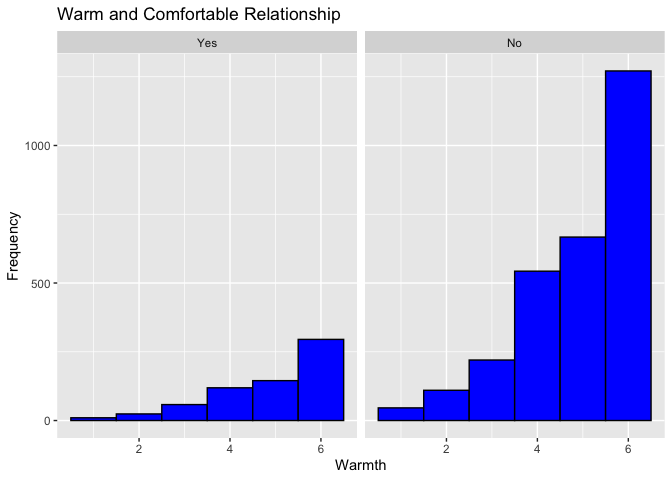
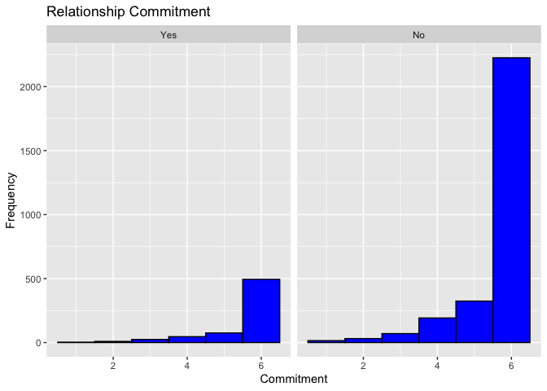
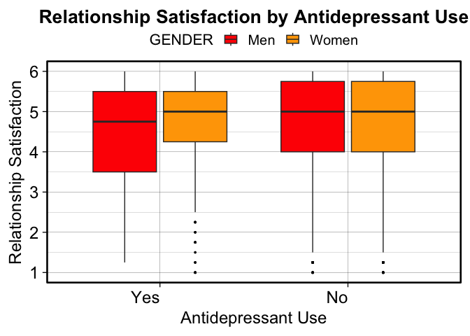

Dataset Project Prep - Lab 6
================
Jennifer Habicher
2024-10-10

# load packages and dataset

``` r
library (haven)
library (dplyr)
```

    ## 
    ## Attaching package: 'dplyr'

    ## The following objects are masked from 'package:stats':
    ## 
    ##     filter, lag

    ## The following objects are masked from 'package:base':
    ## 
    ##     intersect, setdiff, setequal, union

``` r
library (ggplot2)
library (psych)
```

    ## 
    ## Attaching package: 'psych'

    ## The following objects are masked from 'package:ggplot2':
    ## 
    ##     %+%, alpha

``` r
library (car)
```

    ## Loading required package: carData

    ## 
    ## Attaching package: 'car'

    ## The following object is masked from 'package:psych':
    ## 
    ##     logit

    ## The following object is masked from 'package:dplyr':
    ## 
    ##     recode

``` r
library (multcomp)
```

    ## Loading required package: mvtnorm

    ## Loading required package: survival

    ## Loading required package: TH.data

    ## Loading required package: MASS

    ## 
    ## Attaching package: 'MASS'

    ## The following object is masked from 'package:dplyr':
    ## 
    ##     select

    ## 
    ## Attaching package: 'TH.data'

    ## The following object is masked from 'package:MASS':
    ## 
    ##     geyser

``` r
#load Dataset
load("ICPSR_38417/DS0001/38417-0001-Data.rda")
```

``` r
Selected_Dataset <- da38417.0001 %>%
  dplyr::select(Q17_1, Q19, Q20, Q21, Q22, Q117, Q65, Q55E, D2, HHR5, IDENTITY_1_R)
```

# Recode Variables

``` r
#Q17_1: Please indicate the level of happiness, all things considered, in your relationship 
Selected_Dataset$Q17_1 <- dplyr::recode(Selected_Dataset$Q17_1, "(1) Extremely unhappy" = 1, "(2) Fairly unhappy" = 2, "(3) A little unhappy" = 3, "(4) Happy" = 4, "(5) Very happy" = 5, "(6) Extremely happy" = 6, "(7) Perfect" = 7)

#Q19: I have a warm and comfortable relationship with my spouse/partner
Selected_Dataset$Q19 <- dplyr::recode(Selected_Dataset$Q19, "(1) Not at all true" = 1, "(2) A little true" = 2, "(3) Somewhat true" = 3, "(4) Mostly true" = 4, "(5) Almost completely true" = 5, "(6) Completely true" = 6)

#Q20: How rewarding is your relationship with your spouse/partner? 
Selected_Dataset$Q20 <- dplyr::recode(Selected_Dataset$Q20, "(1) Not at all rewarding" = 1, "(2) A little rewarding" = 2, "(3) Somewhat rewarding" = 3, "(4) Mostly rewarding" = 4, "(5) Almost completely rewarding" = 5, "(6) Completely rewarding" = 6)

#Q21: In general, how satisfied are you with your relationship? 
Selected_Dataset$Q21 <- dplyr::recode(Selected_Dataset$Q21, "(1) Not at all satisfied" = 1, "(2) A little satisfied" = 2, "(3) Somewhat satisfied" = 3, "(4) Mostly satisfied" = 4, "(5) Almost completely satisfied" = 5, "(6) Completely satisfied" = 6)

#Q22: In general, how committed are you to your current spouse/partner?
Selected_Dataset$COMMITMENT <- dplyr::recode(Selected_Dataset$Q22, "(1) Not at all committed" = 1, "(2) A little committed" = 2, "(3) Somewhat committed" = 3, "(4) Mostly committed" = 4, "(5) Almost completely committed" = 5, "(6) Completely committed" = 6)

#Q117: How satisfied are you with your sexual relationship with your current spouse/partner? 
Selected_Dataset$SEXUAL_SATISFACTION <- dplyr::recode(Selected_Dataset$Q117, "(1) Very dissatisfied" = 1, "(2) Somewhat dissatisfied" = 2, "(3) Neither satisfied or dissatisfied" = 3, "(4) Somewhat satisfied" = 4, "(5) Very satisfied" = 5)

#Q65: In the past 30 days have you used antidepressant medication
Selected_Dataset$ANTIDEPRESSANT_USE <- dplyr::recode(Selected_Dataset$Q65, "(1) Yes" = "Yes", "(2) No" = "No")

#Q55E: I felt depressed
Selected_Dataset$DEPRESSION_LEVEL <- dplyr::recode(Selected_Dataset$Q55E, "(1) Rarely or none of the time (Less than 1 day)" = "Rarely/None", "(2) Some or a little of the time (1-2 days)" = "Some", "(3) Occasionally or a moderate amount of time (3-4 days)" = "Occasionally", "(4) Most or all of the time (5-7 days)" = "Most/All")

#D2: Which of the following best describes your gender?
Selected_Dataset$GENDER <- dplyr::recode(Selected_Dataset$D2, "(1) Man" = "Men", "(2) Woman" = "Women", "(3) Transgender" = "Transgender","(5) Do not identify as any of the above (there is an option to specify at next question)" = "Other")

#IDENTITY_1_R IDENTITY. Which of the following do you consider yourself to be? (select all that apply) 1. Heterosexual or "straight"
Selected_Dataset$SEXUAL_IDENTITY <- dplyr::recode(Selected_Dataset$IDENTITY_1_R, "(1) Heterosexual" = "Heterosexual", "(-99) Valid Non-Response" = "Other")

#Remove NA values
Selected_Dataset <- na.omit(Selected_Dataset)
```

\#Graphs for Recoded Variables

``` r
#Q17_1: Please indicate the level of happiness, all things considered, in your relationship 
#Grouped by GENDER
ggplot(Selected_Dataset, aes(x = Q17_1)) + facet_wrap(~GENDER) +
  geom_histogram(binwidth = 1, fill = "blue", color = "black") +
  labs(title = "Relationship Happiness", x = "Happiness", y = "Frequency")
```

<!-- -->

``` r
#Grouped by SEXUAL_IDENTITY
ggplot(Selected_Dataset, aes(x = Q17_1)) + facet_wrap(~SEXUAL_IDENTITY) +
  geom_histogram(binwidth = 1, fill = "blue", color = "black") +
  labs(title = "Relationship Happiness", x = "Happiness", y = "Frequency")
```

<!-- -->

``` r
#Q19: I have a warm and comfortable relationship with my spouse/partner
#Grouped by GENDER
ggplot(Selected_Dataset, aes(x = Q19)) + facet_wrap(~GENDER) +
  geom_histogram(binwidth = 1, fill = "blue", color = "black") +
  labs(title = "Warm and Comfortable Relationship", x = "Warmth", y = "Frequency")
```

<!-- -->

``` r
#Grouped by SEXUAL_IDENTITY
ggplot(Selected_Dataset, aes(x = Q19)) + facet_wrap(~SEXUAL_IDENTITY) +
  geom_histogram(binwidth = 1, fill = "blue", color = "black") +
  labs(title = "Warm and Comfortable Relationship", x = "Warmth", y = "Frequency")
```

<!-- -->

``` r
#Q20: How rewarding is your relationship with your spouse/partner? 
#Grouped by GENDER
ggplot(Selected_Dataset, aes(x = Q20))  + facet_wrap(~GENDER) +
  geom_histogram(binwidth = 1, fill = "blue", color = "black") +
  labs(title = "Rewarding Relationship", x = "Reward", y = "Frequency")
```

<!-- -->

``` r
#Grouped by SEXUAL_IDENTITY
ggplot(Selected_Dataset, aes(x = Q20)) + facet_wrap(~SEXUAL_IDENTITY) +
  geom_histogram(binwidth = 1, fill = "blue", color = "black") +
  labs(title = "Rewarding Relationship", x = "Reward", y = "Frequency")
```

<!-- -->

``` r
#Q21: In general, how satisfied are you with your relationship?
#Grouped by GENDER
ggplot(Selected_Dataset, aes(x = Q21))  + facet_wrap(~GENDER) +
  geom_histogram(binwidth = 1, fill = "blue", color = "black") +
  labs(title = "Relationship Satisfaction", x = "Satisfaction", y = "Frequency")
```

<!-- -->

``` r
#Grouped by SEXUAL_IDENTITY
ggplot(Selected_Dataset, aes(x = Q21)) + facet_wrap(~SEXUAL_IDENTITY) +
  geom_histogram(binwidth = 1, fill = "blue", color = "black") +
  labs(title = "Relationship Satisfaction", x = "Satisfaction", y = "Frequency")
```

<!-- -->

``` r
#Q22: In general, how committed are you to your current spouse/partner? (Numeric)
#Grouped by GENDER
ggplot(Selected_Dataset, aes(x = COMMITMENT))  + facet_wrap(~GENDER) +
  geom_histogram(binwidth = 1, fill = "blue", color = "black") +
  labs(title = "Relationship Commitment", x = "Commitment", y = "Frequency")
```

<!-- -->

``` r
#Grouped by SEXUAL_IDENTITY
ggplot(Selected_Dataset, aes(x = COMMITMENT)) + facet_wrap(~SEXUAL_IDENTITY) +
  geom_histogram(binwidth = 1, fill = "blue", color = "black") +
  labs(title = "Relationship Commitment", x = "Commitment", y = "Frequency")
```

<!-- -->

``` r
#Q117: How satisfied are you with your sexual relationship with your current spouse/partner? 
#Grouped by GENDER
ggplot(Selected_Dataset, aes(x = SEXUAL_SATISFACTION))  + facet_wrap(~GENDER) +
  geom_histogram(binwidth = 1, fill = "blue", color = "black") +
  labs(title = "Sexual Relationship Satisfaction", x = "Satisfaction", y = "Frequency")
```

<!-- -->

``` r
#Grouped by SEXUAL_IDENTITY
ggplot(Selected_Dataset, aes(x = SEXUAL_SATISFACTION)) + facet_wrap(~SEXUAL_IDENTITY) +
  geom_histogram(binwidth = 1, fill = "blue", color = "black") +
  labs(title = "Sexual Relationship Satisfaction", x = "Satisfaction", y = "Frequency")
```

<!-- -->

``` r
#Q65: In the past 30 days have you used antidepressant medication?
#Grouped by GENDER
ggplot(Selected_Dataset, aes(x = ANTIDEPRESSANT_USE))  + facet_wrap(~GENDER) +
  geom_histogram(binwidth = 1, fill = "blue", color = "black", stat = "count") +
  labs(title = "Antidepressant Use", x = "Use", y = "Frequency")
```

    ## Warning in geom_histogram(binwidth = 1, fill = "blue", color = "black", :
    ## Ignoring unknown parameters: `binwidth`, `bins`, and `pad`

<!-- -->

``` r
#Grouped by SEXUAL_IDENTITY
ggplot(Selected_Dataset, aes(x = ANTIDEPRESSANT_USE)) + facet_wrap(~SEXUAL_IDENTITY) +
  geom_histogram(binwidth = 1, fill = "blue", color = "black", stat = "count") +
  labs(title = "Antidepressant Use", x = "Use", y = "Frequency")
```

    ## Warning in geom_histogram(binwidth = 1, fill = "blue", color = "black", :
    ## Ignoring unknown parameters: `binwidth`, `bins`, and `pad`

<!-- -->

# Create Composite Variable

``` r
#For Relationship Satisfaction I will produce one composite variable out of variables Q17_1, Q19, Q20, Q21
#Mutate and create a new column. Use the average of each participants scores
Selected_Dataset$Relationship_Satisfaction <- rowMeans(Selected_Dataset %>% dplyr::select(Q17_1, Q19, Q20, Q21), na.rm = TRUE)

#plot the composite variable
ggplot(Selected_Dataset, aes(x = Relationship_Satisfaction)) +
  geom_histogram(binwidth = 1, fill = "blue", color = "black") +
  labs(title = "Relationship Satisfaction Composite Variable", x = "Relationship Satisfaction", y = "Frequency")
```

<!-- -->

``` r
#Group By GENDER
ggplot(Selected_Dataset, aes(x = Relationship_Satisfaction)) + facet_wrap(~GENDER) +
  geom_histogram(binwidth = 1, fill = "blue", color = "black") +
  labs(title = "Relationship Satisfaction Composite Variable", x = "Relationship Satisfaction", y = "Frequency")
```

<!-- -->

``` r
#Group By SEXUAL_IDENTITY
ggplot(Selected_Dataset, aes(x = Relationship_Satisfaction)) + facet_wrap(~SEXUAL_IDENTITY) +
  geom_histogram(binwidth = 1, fill = "blue", color = "black") +
  labs(title = "Relationship Satisfaction Composite Variable", x = "Relationship Satisfaction", y = "Frequency")
```

<!-- -->

``` r
#Group By ANTIDEPRESSANT_USE
ggplot(Selected_Dataset, aes(x = Relationship_Satisfaction)) + facet_wrap(~ANTIDEPRESSANT_USE) +
  geom_histogram(binwidth = 1, fill = "blue", color = "black") +
  labs(title = "Relationship Satisfaction Composite Variable", x = "Relationship Satisfaction", y = "Frequency")
```

<!-- -->

``` r
#Group By DEPRESSION_LEVEL
ggplot(Selected_Dataset, aes(x = Relationship_Satisfaction)) + facet_wrap(~DEPRESSION_LEVEL) +
  geom_histogram(binwidth = 1, fill = "blue", color = "black") +
  labs(title = "Relationship Satisfaction Composite Variable", x = "Relationship Satisfaction", y = "Frequency")
```

<!-- -->

\#Check Normality of Distribution for each variable

``` r
#Normality is not required for Large N due to the central limit theorem, but I will check for the sake of practice.

kruskal.test(Selected_Dataset$Relationship_Satisfaction ~ Selected_Dataset$GENDER)
```

    ## 
    ##  Kruskal-Wallis rank sum test
    ## 
    ## data:  Selected_Dataset$Relationship_Satisfaction by Selected_Dataset$GENDER
    ## Kruskal-Wallis chi-squared = 2.5942, df = 3, p-value = 0.4585

``` r
kruskal.test(Selected_Dataset$Relationship_Satisfaction ~ Selected_Dataset$SEXUAL_IDENTITY)
```

    ## 
    ##  Kruskal-Wallis rank sum test
    ## 
    ## data:  Selected_Dataset$Relationship_Satisfaction by Selected_Dataset$SEXUAL_IDENTITY
    ## Kruskal-Wallis chi-squared = 1.098, df = 1, p-value = 0.2947

``` r
kruskal.test(Selected_Dataset$Relationship_Satisfaction ~ Selected_Dataset$ANTIDEPRESSANT_USE)
```

    ## 
    ##  Kruskal-Wallis rank sum test
    ## 
    ## data:  Selected_Dataset$Relationship_Satisfaction by Selected_Dataset$ANTIDEPRESSANT_USE
    ## Kruskal-Wallis chi-squared = 0.6303, df = 1, p-value = 0.4272

``` r
kruskal.test(Selected_Dataset$Relationship_Satisfaction ~ Selected_Dataset$DEPRESSION_LEVEL)
```

    ## 
    ##  Kruskal-Wallis rank sum test
    ## 
    ## data:  Selected_Dataset$Relationship_Satisfaction by Selected_Dataset$DEPRESSION_LEVEL
    ## Kruskal-Wallis chi-squared = 240.26, df = 3, p-value < 2.2e-16

``` r
kruskal.test(Selected_Dataset$SEXUAL_SATISFACTION ~ Selected_Dataset$GENDER)
```

    ## 
    ##  Kruskal-Wallis rank sum test
    ## 
    ## data:  Selected_Dataset$SEXUAL_SATISFACTION by Selected_Dataset$GENDER
    ## Kruskal-Wallis chi-squared = 21.798, df = 3, p-value = 7.187e-05

``` r
kruskal.test(Selected_Dataset$SEXUAL_SATISFACTION ~ Selected_Dataset$SEXUAL_IDENTITY)
```

    ## 
    ##  Kruskal-Wallis rank sum test
    ## 
    ## data:  Selected_Dataset$SEXUAL_SATISFACTION by Selected_Dataset$SEXUAL_IDENTITY
    ## Kruskal-Wallis chi-squared = 43.625, df = 1, p-value = 3.976e-11

``` r
kruskal.test(Selected_Dataset$SEXUAL_SATISFACTION ~ Selected_Dataset$ANTIDEPRESSANT_USE)
```

    ## 
    ##  Kruskal-Wallis rank sum test
    ## 
    ## data:  Selected_Dataset$SEXUAL_SATISFACTION by Selected_Dataset$ANTIDEPRESSANT_USE
    ## Kruskal-Wallis chi-squared = 10.107, df = 1, p-value = 0.001477

``` r
kruskal.test(Selected_Dataset$SEXUAL_SATISFACTION ~ Selected_Dataset$DEPRESSION_LEVEL)
```

    ## 
    ##  Kruskal-Wallis rank sum test
    ## 
    ## data:  Selected_Dataset$SEXUAL_SATISFACTION by Selected_Dataset$DEPRESSION_LEVEL
    ## Kruskal-Wallis chi-squared = 147.5, df = 3, p-value < 2.2e-16

\#Check for Equality of Variance

``` r
#Levine's Test

leveneTest(Selected_Dataset$Relationship_Satisfaction ~ Selected_Dataset$GENDER)
```

    ## Levene's Test for Homogeneity of Variance (center = median)
    ##         Df F value Pr(>F)
    ## group    3  1.0426 0.3725
    ##       3504

``` r
# Fail to reject Null Hypothesis: Variances are equal

leveneTest(Selected_Dataset$Relationship_Satisfaction ~ Selected_Dataset$SEXUAL_IDENTITY)
```

    ## Levene's Test for Homogeneity of Variance (center = median)
    ##         Df F value    Pr(>F)    
    ## group    1  11.011 0.0009152 ***
    ##       3506                      
    ## ---
    ## Signif. codes:  0 '***' 0.001 '**' 0.01 '*' 0.05 '.' 0.1 ' ' 1

``` r
# Reject Null Hypothesis: Variances are not equal -- Use Welch ANOVA 

leveneTest(Selected_Dataset$Relationship_Satisfaction ~ Selected_Dataset$ANTIDEPRESSANT_USE)
```

    ## Levene's Test for Homogeneity of Variance (center = median)
    ##         Df F value Pr(>F)
    ## group    1  0.5837 0.4449
    ##       3506

``` r
# Fail to reject Null Hypothesis: Variances are equal

leveneTest(Selected_Dataset$Relationship_Satisfaction ~ Selected_Dataset$DEPRESSION_LEVEL)
```

    ## Levene's Test for Homogeneity of Variance (center = median)
    ##         Df F value    Pr(>F)    
    ## group    3  27.647 < 2.2e-16 ***
    ##       3504                      
    ## ---
    ## Signif. codes:  0 '***' 0.001 '**' 0.01 '*' 0.05 '.' 0.1 ' ' 1

``` r
# Reject Null Hypothesis: Variances are not equal -- Use Welch ANOVA

leveneTest(Selected_Dataset$SEXUAL_SATISFACTION ~ Selected_Dataset$GENDER)
```

    ## Levene's Test for Homogeneity of Variance (center = median)
    ##         Df F value  Pr(>F)  
    ## group    3  2.8968 0.03385 *
    ##       3504                  
    ## ---
    ## Signif. codes:  0 '***' 0.001 '**' 0.01 '*' 0.05 '.' 0.1 ' ' 1

``` r
# Reject Null Hypothesis: Variances are not equal -- Use Welch ANOVA 

leveneTest(Selected_Dataset$SEXUAL_SATISFACTION ~ Selected_Dataset$SEXUAL_IDENTITY)
```

    ## Levene's Test for Homogeneity of Variance (center = median)
    ##         Df F value  Pr(>F)  
    ## group    1  3.0073 0.08298 .
    ##       3506                  
    ## ---
    ## Signif. codes:  0 '***' 0.001 '**' 0.01 '*' 0.05 '.' 0.1 ' ' 1

``` r
# Fail to reject Null Hypothesis: Variances are equal

leveneTest(Selected_Dataset$SEXUAL_SATISFACTION ~ Selected_Dataset$ANTIDEPRESSANT_USE)
```

    ## Levene's Test for Homogeneity of Variance (center = median)
    ##         Df F value Pr(>F)
    ## group    1  1.9812 0.1593
    ##       3506

``` r
# Fail to reject Null Hypothesis: Variances are equal

leveneTest(Selected_Dataset$SEXUAL_SATISFACTION ~ Selected_Dataset$DEPRESSION_LEVEL)
```

    ## Levene's Test for Homogeneity of Variance (center = median)
    ##         Df F value    Pr(>F)    
    ## group    3  10.238 1.039e-06 ***
    ##       3504                      
    ## ---
    ## Signif. codes:  0 '***' 0.001 '**' 0.01 '*' 0.05 '.' 0.1 ' ' 1

``` r
# Reject Null Hypothesis: Variances are not equal -- Use Welch ANOVA 
```

\#Check Independent Observation Assumption

Given the nature of the survey, I assume that they design of this survey
means that respondents are all independent of each other.

\#Violated Assumptions and Fixes

For the tests that do not pass the assumptions of homogeneity of
variance, I use Welch’s ANOVA.

\#Data Analysis

\#Does Anti Depressant use impact Relationship Satisfaction?

``` r
#Independent Samples T-Test
t.test(Selected_Dataset$Relationship_Satisfaction ~ Selected_Dataset$ANTIDEPRESSANT_USE)
```

    ## 
    ##  Welch Two Sample t-test
    ## 
    ## data:  Selected_Dataset$Relationship_Satisfaction by Selected_Dataset$ANTIDEPRESSANT_USE
    ## t = -0.94371, df = 953.34, p-value = 0.3456
    ## alternative hypothesis: true difference in means between group Yes and group No is not equal to 0
    ## 95 percent confidence interval:
    ##  -0.14743419  0.05168263
    ## sample estimates:
    ## mean in group Yes  mean in group No 
    ##          4.686636          4.734512

``` r
ggplot(Selected_Dataset, aes(x = ANTIDEPRESSANT_USE, y = Relationship_Satisfaction)) +
  geom_boxplot() +
  labs(title = "Relationship Satisfaction by Antidepressant Use", x = "Antidepressant Use", y = "Relationship Satisfaction")
```

<!-- -->

``` r
group_by(Selected_Dataset, ANTIDEPRESSANT_USE) %>%
  summarise(mean = mean(Relationship_Satisfaction), sd = sd(Relationship_Satisfaction))
```

    ## # A tibble: 2 × 3
    ##   ANTIDEPRESSANT_USE  mean    sd
    ##   <fct>              <dbl> <dbl>
    ## 1 Yes                 4.69  1.17
    ## 2 No                  4.73  1.15

Result: Fail to reject the null hypothesis Anti-Depressants do not
impact Relationship Satisfaction p = 0.3456

\#Does Anti Depressant use impact Sexual Satisfaction?

``` r
#Independent Samples T-Test
t.test(Selected_Dataset$SEXUAL_SATISFACTION ~ Selected_Dataset$ANTIDEPRESSANT_USE)
```

    ## 
    ##  Welch Two Sample t-test
    ## 
    ## data:  Selected_Dataset$SEXUAL_SATISFACTION by Selected_Dataset$ANTIDEPRESSANT_USE
    ## t = -3.0392, df = 972.47, p-value = 0.002436
    ## alternative hypothesis: true difference in means between group Yes and group No is not equal to 0
    ## 95 percent confidence interval:
    ##  -0.30403597 -0.06545562
    ## sample estimates:
    ## mean in group Yes  mean in group No 
    ##          3.245776          3.430522

``` r
ggplot(Selected_Dataset, aes(x = ANTIDEPRESSANT_USE, y = SEXUAL_SATISFACTION)) +
  geom_boxplot()
```

<!-- -->

``` r
group_by(Selected_Dataset, ANTIDEPRESSANT_USE) %>%
  summarise(mean = mean(SEXUAL_SATISFACTION), sd = sd(SEXUAL_SATISFACTION))
```

    ## # A tibble: 2 × 3
    ##   ANTIDEPRESSANT_USE  mean    sd
    ##   <fct>              <dbl> <dbl>
    ## 1 Yes                 3.25  1.40
    ## 2 No                  3.43  1.41

Result: Reject the null hypothesis Anti-Depressants do impact Sexaul
Satisfaction p = 0.002436

\#Does Depression impact Relationship Satisfaction?

``` r
#ANOVA
oneway.test(Selected_Dataset$Relationship_Satisfaction ~ Selected_Dataset$DEPRESSION_LEVEL, var.equal = FALSE # Assuming UNEqual Variances
            )
```

    ## 
    ##  One-way analysis of means (not assuming equal variances)
    ## 
    ## data:  Selected_Dataset$Relationship_Satisfaction and Selected_Dataset$DEPRESSION_LEVEL
    ## F = 81.954, num df = 3.00, denom df = 731.72, p-value < 2.2e-16

``` r
ggplot(Selected_Dataset, aes(x = DEPRESSION_LEVEL, y = Relationship_Satisfaction)) +
  geom_boxplot()
```

<!-- -->

``` r
group_by(Selected_Dataset, DEPRESSION_LEVEL) %>%
  summarise(mean = mean(Relationship_Satisfaction), sd = sd(Relationship_Satisfaction))
```

    ## # A tibble: 4 × 3
    ##   DEPRESSION_LEVEL  mean    sd
    ##   <fct>            <dbl> <dbl>
    ## 1 Rarely/None       4.98  1.02
    ## 2 Some              4.56  1.14
    ## 3 Occasionally      4.29  1.24
    ## 4 Most/All          3.99  1.42

``` r
#Post Hoc Test
TukeyHSD(aov(Relationship_Satisfaction ~ DEPRESSION_LEVEL, data = Selected_Dataset))
```

    ##   Tukey multiple comparisons of means
    ##     95% family-wise confidence level
    ## 
    ## Fit: aov(formula = Relationship_Satisfaction ~ DEPRESSION_LEVEL, data = Selected_Dataset)
    ## 
    ## $DEPRESSION_LEVEL
    ##                                diff        lwr         upr     p adj
    ## Some-Rarely/None         -0.4224919 -0.5362464 -0.30873734 0.0000000
    ## Occasionally-Rarely/None -0.6909124 -0.8453343 -0.53649049 0.0000000
    ## Most/All-Rarely/None     -0.9960472 -1.1959676 -0.79612681 0.0000000
    ## Occasionally-Some        -0.2684206 -0.4371926 -0.09964849 0.0002600
    ## Most/All-Some            -0.5735553 -0.7847568 -0.36235392 0.0000000
    ## Most/All-Occasionally    -0.3051348 -0.5407448 -0.06952477 0.0048841

Result: Reject the null hypothesis Depression Level does impact
Relationship Satisfaction p = 2.2e-16

\#Does Depression impact Sexual Satisfaction?

``` r
#ANOVA
oneway.test(Selected_Dataset$SEXUAL_SATISFACTION ~ Selected_Dataset$DEPRESSION_LEVEL, var.equal = FALSE # Assuming UNEqual Variances
            )
```

    ## 
    ##  One-way analysis of means (not assuming equal variances)
    ## 
    ## data:  Selected_Dataset$SEXUAL_SATISFACTION and Selected_Dataset$DEPRESSION_LEVEL
    ## F = 49.159, num df = 3.00, denom df = 761.05, p-value < 2.2e-16

``` r
ggplot(Selected_Dataset, aes(x = DEPRESSION_LEVEL, y = SEXUAL_SATISFACTION)) +
  geom_boxplot()
```

<!-- -->

``` r
group_by(Selected_Dataset, DEPRESSION_LEVEL) %>%
  summarise(mean = mean(SEXUAL_SATISFACTION), sd = sd(SEXUAL_SATISFACTION))
```

    ## # A tibble: 4 × 3
    ##   DEPRESSION_LEVEL  mean    sd
    ##   <fct>            <dbl> <dbl>
    ## 1 Rarely/None       3.64  1.36
    ## 2 Some              3.21  1.38
    ## 3 Occasionally      3.01  1.38
    ## 4 Most/All          2.79  1.50

``` r
#Post Hoc Test
TukeyHSD(aov(SEXUAL_SATISFACTION ~ DEPRESSION_LEVEL, data = Selected_Dataset))
```

    ##   Tukey multiple comparisons of means
    ##     95% family-wise confidence level
    ## 
    ## Fit: aov(formula = SEXUAL_SATISFACTION ~ DEPRESSION_LEVEL, data = Selected_Dataset)
    ## 
    ## $DEPRESSION_LEVEL
    ##                                diff        lwr         upr     p adj
    ## Some-Rarely/None         -0.4300526 -0.5715797 -0.28852549 0.0000000
    ## Occasionally-Rarely/None -0.6277035 -0.8198268 -0.43558025 0.0000000
    ## Most/All-Rarely/None     -0.8498253 -1.0985553 -0.60109529 0.0000000
    ## Occasionally-Some        -0.1976509 -0.4076279  0.01232603 0.0736315
    ## Most/All-Some            -0.4197727 -0.6825379 -0.15700743 0.0002406
    ## Most/All-Occasionally    -0.2221217 -0.5152548  0.07101133 0.2084415

Result: Reject the null hypothesis Depression Level does impact Sexual
Satisfaction p = 2.2e-16

\#Does Sexual Identity impact Relationship Satisfaction

``` r
#Independent Samples T-Test
t.test(Selected_Dataset$Relationship_Satisfaction ~ Selected_Dataset$SEXUAL_IDENTITY)
```

    ## 
    ##  Welch Two Sample t-test
    ## 
    ## data:  Selected_Dataset$Relationship_Satisfaction by Selected_Dataset$SEXUAL_IDENTITY
    ## t = 1.8202, df = 3316.8, p-value = 0.06882
    ## alternative hypothesis: true difference in means between group Other and group Heterosexual is not equal to 0
    ## 95 percent confidence interval:
    ##  -0.005454972  0.146828525
    ## sample estimates:
    ##        mean in group Other mean in group Heterosexual 
    ##                   4.766633                   4.695946

``` r
ggplot(Selected_Dataset, aes(x = SEXUAL_IDENTITY, y = Relationship_Satisfaction)) +
  geom_boxplot()
```

<!-- -->

``` r
group_by(Selected_Dataset, SEXUAL_IDENTITY) %>%
  summarise(mean = mean(Relationship_Satisfaction), sd = sd(Relationship_Satisfaction))
```

    ## # A tibble: 2 × 3
    ##   SEXUAL_IDENTITY  mean    sd
    ##   <fct>           <dbl> <dbl>
    ## 1 Other            4.77  1.09
    ## 2 Heterosexual     4.70  1.19

Fail to Reject Null Hypothesis: Sexual Identity does not impact
Relationship Satisfaction p = 0.06882

\#Does Sexual Identity impact Sexual Satisfaction

``` r
#Independent Samples T-Test
t.test(Selected_Dataset$SEXUAL_SATISFACTION ~ Selected_Dataset$SEXUAL_IDENTITY)
```

    ## 
    ##  Welch Two Sample t-test
    ## 
    ## data:  Selected_Dataset$SEXUAL_SATISFACTION by Selected_Dataset$SEXUAL_IDENTITY
    ## t = -6.1403, df = 3237.9, p-value = 9.238e-10
    ## alternative hypothesis: true difference in means between group Other and group Heterosexual is not equal to 0
    ## 95 percent confidence interval:
    ##  -0.3854658 -0.1988758
    ## sample estimates:
    ##        mean in group Other mean in group Heterosexual 
    ##                   3.226748                   3.518919

``` r
ggplot(Selected_Dataset, aes(x = SEXUAL_IDENTITY, y = SEXUAL_SATISFACTION)) +
  geom_boxplot()
```

<!-- -->

``` r
group_by(Selected_Dataset, SEXUAL_IDENTITY) %>%
  summarise(mean = mean(SEXUAL_SATISFACTION), sd = sd(SEXUAL_SATISFACTION))
```

    ## # A tibble: 2 × 3
    ##   SEXUAL_IDENTITY  mean    sd
    ##   <fct>           <dbl> <dbl>
    ## 1 Other            3.23  1.37
    ## 2 Heterosexual     3.52  1.42

Reject the Null Hypothesis: Sexual Identity does impact Sexual
Satisfaction p = 9.238e-10
